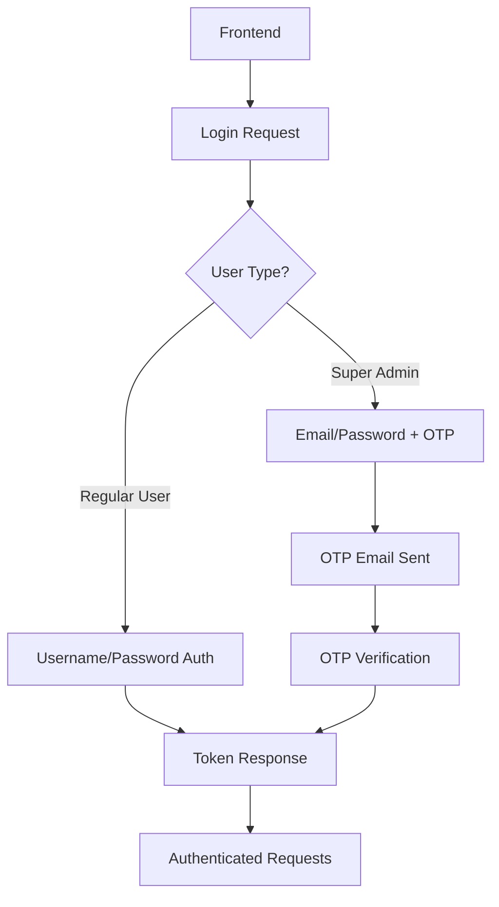

# 🚀 PRS Backend Documentation

## Payment Receiving System (PRS) - Backend API

Welcome to the PRS Backend documentation! This comprehensive guide will help you understand, integrate with, and maintain the PRS system.

---

## 📋 **TABLE OF CONTENTS**

### 🚀 **Getting Started**
- [📖 Installation & Setup Guide](./setup_guide.md)
- [🔧 Configuration Guide](./configuration_guide.md)
- [🐳 Docker Setup](./docker_setup.md)

### 🌐 **API Documentation**
- [🔑 Authentication API](./api_authentication.md)
- [📊 Complete API Reference](./api_reference.md)
- [🔗 Frontend Integration Guide](./frontend_integration.md)

### 🔧 **System Components**
- [📧 Email System](./email_system_implementation.md)
- [🗄️ Database Schema](./database_schema.md)
- [🔒 Security & Permissions](./security_guide.md)

### 🛠️ **Development**
- [📝 Coding Standards](./coding_rules.md)
- [🧪 Testing Guide](./testing_guide.md)
- [🚀 Deployment Guide](./deployment_guide.md)

### 📖 **Reference**
- [🔍 Troubleshooting](./troubleshooting.md)
- [📈 Performance Guide](./performance_guide.md)
- [🔄 Migration Guide](./migration_guide.md)

---

## 🎯 **QUICK START**

### 1. **Installation**
```bash
# Clone the repository
git clone <repository-url>
cd Backend_PRS-1/backend

# Create virtual environment
python -m venv .venv
source .venv/bin/activate  # Windows: .venv\Scripts\activate

# Install dependencies
pip install -r requirements.txt

# Setup database
python manage.py migrate

# Create superadmin
python manage.py setup_superadmin --email admin@example.com --password your_password

# Run development server
python manage.py runserver
```

### 2. **API Base URL**
```
Development: http://localhost:8000/api/v1/
Production: https://your-domain.com/api/v1/
```

### 3. **First API Call**
```javascript
// Test API connectivity
fetch('http://localhost:8000/api/v1/auth/', {
    method: 'GET',
    headers: {
        'Content-Type': 'application/json'
    }
})
.then(response => response.json())
.then(data => console.log('API is working:', data));
```

---

## 🏗️ **SYSTEM ARCHITECTURE**

### **Backend Components**
```
PRS Backend
├── 🔑 Authentication System
│   ├── User Management
│   ├── Role-Based Permissions
│   └── OTP-based Super Admin Login
├── 🏢 Organization Management
│   ├── Multi-tenant Architecture
│   ├── Role Assignments
│   └── Team Management
├── 👥 Client Management
│   ├── Client Registration
│   ├── Contact Information
│   └── Organization Association
├── 💼 Deal Management
│   ├── Deal Creation & Tracking
│   ├── Payment Processing
│   └── Receipt Management
├── 💰 Commission System
│   ├── Automatic Calculations
│   ├── Multi-level Commissions
│   └── Payment Tracking
├── 📧 Notification System
│   ├── Real-time Notifications
│   ├── Email Notifications
│   └── Notification Preferences
└── 🔒 Security Features
    ├── Rate Limiting
    ├── Session Management
    └── Audit Logging
```

---

## 🔑 **AUTHENTICATION OVERVIEW**

### **Authentication Flow**


### **API Endpoints Quick Reference**
```
POST /api/v1/auth/login/                    # Regular user login
POST /api/v1/auth/super-admin/login/        # Super admin login (step 1)
POST /api/v1/auth/super-admin/verify/       # Super admin OTP verification (step 2)
POST /api/v1/auth/logout/                   # Logout
GET  /api/v1/auth/sessions/                 # List user sessions
```

---

## 🌟 **KEY FEATURES**

### ✅ **Robust Email System**
- **Multi-provider SMTP support** with automatic fallbacks
- **Retry logic** with exponential backoff
- **Console fallback** for development
- **OTP email delivery** for super admin authentication

### ✅ **Multi-tenant Architecture**
- **Organization-based data isolation**
- **Role-based access control**
- **Scalable user management**

### ✅ **Comprehensive API**
- **RESTful design** with consistent responses
- **Token-based authentication**
- **Detailed error handling**
- **API documentation** with Swagger/OpenAPI

### ✅ **Security First**
- **Rate limiting** on sensitive endpoints
- **Session management** with audit trails
- **Input validation** and sanitization
- **CORS protection** and security headers

---

## 🛡️ **SECURITY CONSIDERATIONS**

### **Authentication Security**
- Token-based authentication with session tracking
- Rate limiting on login attempts
- Secure OTP generation and verification
- Password strength requirements

### **Data Protection**
- Organization-based data isolation
- Role-based access control
- Audit logging for sensitive operations
- Secure file upload handling

### **Network Security**
- HTTPS enforcement in production
- CORS configuration
- Security headers middleware
- Input validation and sanitization

---

## 📞 **SUPPORT & MAINTENANCE**

### **Common Tasks**
```bash
# Create superadmin user
python manage.py setup_superadmin --email admin@example.com

# Clean up test data
python manage.py cleanup_test_data

# Database backup
python manage.py dumpdata > backup.json

# Check system health
python manage.py check
```

### **Logs & Monitoring**
- Security logs: `logs/security.log`
- Email logs: Check console output or email notification logs
- Django logs: Standard Django logging configuration

---

## 🔗 **USEFUL LINKS**

- **Django Documentation**: https://docs.djangoproject.com/
- **Django REST Framework**: https://www.django-rest-framework.org/
- **API Testing**: Use Postman, Insomnia, or built-in Swagger UI
- **Database**: SQLite (development) / PostgreSQL (production)

---

## 📝 **CHANGELOG**

### **Latest Updates**
- ✅ **Robust Email Backend**: Multi-provider SMTP with fallbacks
- ✅ **Enhanced Security**: Rate limiting and session management
- ✅ **API Improvements**: Consistent error handling and responses
- ✅ **Documentation**: Comprehensive guides for all components

---

For detailed information on any topic, please refer to the specific documentation files linked above.

**Happy coding! 🚀** 