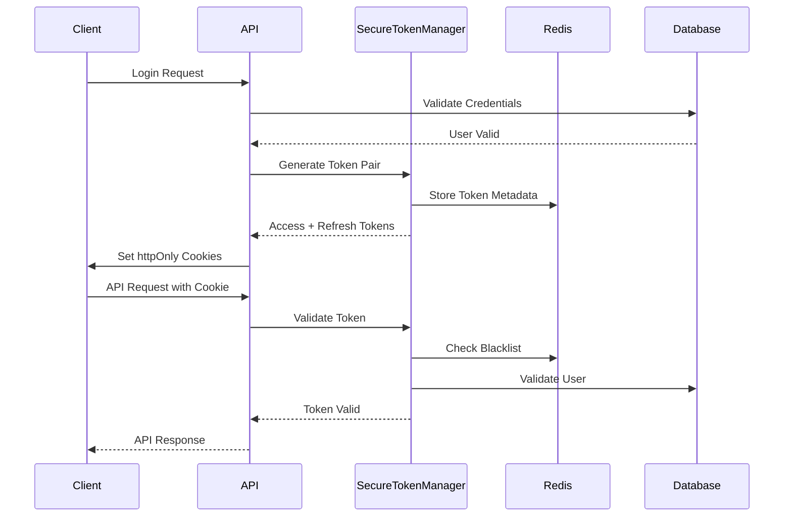

# SecureTokenManager Implementation

## Overview

The SecureTokenManager is an enhanced JWT authentication system that provides comprehensive security features for the PRS (Payment Receiving System). It replaces localStorage token storage with httpOnly cookies, implements token rotation and refresh mechanisms, and adds secure token validation with proper signing.

## Features Implemented

### 1. Enhanced JWT Token Management

- **Secure Token Generation**: Creates JWT tokens with comprehensive security claims
- **Token Rotation**: Automatic token refresh with blacklisting of old tokens
- **Token Validation**: Enhanced validation with security checks and request context validation
- **Token Revocation**: Individual and mass token revocation capabilities

### 2. Security Enhancements

- **httpOnly Cookies**: Secure token storage using httpOnly cookies instead of localStorage
- **Token Age Validation**: Prevents use of tokens that are too old
- **Request Context Validation**: IP address and user agent tracking for security monitoring
- **Token Format Validation**: Comprehensive validation of token structure
- **Blacklist Management**: Redis-based token blacklisting for revoked tokens

### 3. Session Management

- **Token Metadata Storage**: Stores token metadata for security tracking
- **User Token Versioning**: Version-based token invalidation for forced logouts
- **Concurrent Session Management**: Support for multiple active sessions per user

## Architecture

### Core Components

1. **SecureTokenManager**: Main JWT token management class
2. **JWTAuthentication**: DRF authentication backend
3. **SecureCookieManager**: httpOnly cookie management
4. **JWT Views**: Authentication endpoints

### Security Flow



## Implementation Details

### Token Structure

```json
{
  "iss": "prs-backend",
  "sub": "user_id",
  "iat": 1640995200,
  "exp": 1640998800,
  "jti": "unique_token_id",
  "token_type": "access|refresh",
  "user_email": "user@example.com",
  "user_role": "role_name",
  "organization_id": "org_id",
  "token_version": 1
}
```

### Security Features

#### 1. Token Age Validation
```python
token_age = timezone.now().timestamp() - payload.get('iat', 0)
max_token_age = self.REFRESH_TOKEN_LIFETIME.total_seconds()
if token_age > max_token_age:
    raise AuthenticationFailed('Token is too old')
```

#### 2. Request Context Validation
```python
def _validate_request_context(self, payload, request):
    # IP address consistency checking
    # User agent validation
    # Security event logging
```

#### 3. Token Blacklisting
```python
def _blacklist_token(self, token_id: str):
    cache_key = f"jwt_blacklist:{token_id}"
    cache.set(cache_key, True, timeout=self.REFRESH_TOKEN_LIFETIME.total_seconds())
```

### Cookie Security

```python
response.set_cookie(
    'access_token',
    tokens['access_token'],
    max_age=int(SecureTokenManager.ACCESS_TOKEN_LIFETIME.total_seconds()),
    httponly=True,
    secure=secure,
    samesite='Strict'
)
```

## API Endpoints

### Authentication Endpoints

| Endpoint | Method | Description |
|----------|--------|-------------|
| `/api/auth/jwt/login/` | POST | Login with email/password |
| `/api/auth/jwt/verify-otp/` | POST | Verify OTP for admin users |
| `/api/auth/jwt/refresh/` | POST | Refresh access token |
| `/api/auth/jwt/logout/` | POST | Logout and revoke tokens |
| `/api/auth/jwt/logout-all/` | POST | Logout from all devices |
| `/api/auth/jwt/change-password/` | POST | Change password |
| `/api/auth/jwt/profile/` | GET | Get user profile |

### Request/Response Examples

#### Login Request
```json
{
  "email": "user@example.com",
  "password": "password123"
}
```

#### Login Response
```json
{
  "success": true,
  "user": {
    "id": 1,
    "email": "user@example.com",
    "first_name": "John",
    "last_name": "Doe",
    "role": "Organization Admin",
    "organization": "Test Org"
  },
  "message": "Login successful"
}
```

## Configuration

### Settings Configuration

```python
# JWT Authentication Settings
JWT_SECRET_KEY = env('JWT_SECRET_KEY', default=SECRET_KEY + '_jwt')
JWT_REFRESH_SECRET_KEY = env('JWT_REFRESH_SECRET_KEY', default=SECRET_KEY + '_jwt_refresh')

# DRF Authentication Classes
REST_FRAMEWORK = {
    'DEFAULT_AUTHENTICATION_CLASSES': [
        'core_config.jwt_auth.JWTAuthentication',
        'rest_framework.authentication.TokenAuthentication',  # Fallback
    ],
}
```

### Token Lifetimes

- **Access Token**: 15 minutes (short-lived for security)
- **Refresh Token**: 7 days (longer-lived for user convenience)

## Security Considerations

### 1. Token Storage
- Uses httpOnly cookies instead of localStorage
- Prevents XSS attacks from accessing tokens
- Secure and SameSite=Strict flags for CSRF protection

### 2. Token Validation
- Comprehensive format validation
- Age validation to prevent replay attacks
- User status validation (active/inactive)
- Token version checking for forced logouts

### 3. Request Context Validation
- IP address consistency checking
- User agent tracking
- Security event logging for suspicious activity

### 4. Token Revocation
- Individual token revocation via blacklisting
- Mass token revocation via version incrementing
- Automatic cleanup of expired tokens

## Testing

### Test Coverage

The implementation includes comprehensive tests covering:

1. **Token Generation**: Validates proper JWT structure and claims
2. **Token Validation**: Tests all validation scenarios including edge cases
3. **Security Features**: Tests IP validation, token age, format validation
4. **Token Refresh**: Validates refresh mechanism and blacklisting
5. **Token Revocation**: Tests individual and mass revocation
6. **Authentication Backend**: Tests DRF integration
7. **Cookie Management**: Tests secure cookie handling

### Running Tests

```bash
# Run specific SecureTokenManager tests
python manage.py test core_config.tests.test_secure_token_manager

# Run comprehensive JWT tests
python test_secure_token_manager.py

# Run management command test
python manage.py test_secure_token_manager --verbose
```

## Migration from Previous System

### Changes Made

1. **Class Rename**: `JWTTokenManager` → `SecureTokenManager`
2. **Enhanced Validation**: Added comprehensive security checks
3. **Request Context**: Added IP and user agent validation
4. **Token Metadata**: Enhanced metadata storage and retrieval
5. **Security Logging**: Improved security event logging

### Backward Compatibility

- Maintains backward compatibility through alias: `jwt_manager = secure_token_manager`
- Existing endpoints continue to work
- Gradual migration path available

## Performance Considerations

### Caching Strategy

- Token metadata cached in Redis
- Blacklist stored in Redis with TTL
- User token versions cached for quick access

### Optimization Features

- Efficient token validation with minimal database queries
- Cached user token versions to avoid database hits
- Optimized blacklist checking with Redis

## Monitoring and Logging

### Security Events Logged

1. **Authentication Attempts**: Success/failure with details
2. **Token Generation**: User and request context
3. **Token Validation Failures**: Invalid tokens, expired tokens
4. **IP Address Changes**: Potential security incidents
5. **Mass Token Revocation**: Security-related events

### Metrics to Monitor

- Token generation rate
- Token validation failures
- IP address changes
- Failed authentication attempts
- Token refresh frequency

## Future Enhancements

### Planned Features

1. **Token Introspection**: Endpoint to check token status
2. **Advanced Rate Limiting**: Per-user token generation limits
3. **Geolocation Validation**: Location-based security checks
4. **Device Fingerprinting**: Enhanced device tracking
5. **Token Analytics**: Detailed usage analytics

### Security Improvements

1. **Hardware Security Module**: HSM integration for key management
2. **Certificate-based Authentication**: PKI integration
3. **Biometric Integration**: Multi-factor authentication
4. **Zero-Trust Architecture**: Enhanced security model

## Troubleshooting

### Common Issues

1. **Token Validation Failures**
   - Check token format and expiration
   - Verify secret key configuration
   - Check Redis connectivity for blacklist

2. **Cookie Issues**
   - Verify secure flag settings
   - Check SameSite configuration
   - Ensure httpOnly flag is set

3. **Performance Issues**
   - Monitor Redis performance
   - Check token validation frequency
   - Optimize database queries

### Debug Commands

```bash
# Test token manager functionality
python manage.py test_secure_token_manager --verbose

# Check Redis connectivity
python manage.py shell -c "from django.core.cache import cache; print(cache.get('test'))"

# Validate JWT configuration
python manage.py shell -c "from core_config.jwt_auth import SecureTokenManager; print(SecureTokenManager().secret_key[:10])"
```

## Conclusion

The SecureTokenManager implementation provides a robust, secure, and scalable JWT authentication system for the PRS application. It addresses all the security requirements outlined in the specification while maintaining performance and usability.

The implementation follows security best practices, provides comprehensive testing, and includes monitoring capabilities for production deployment.