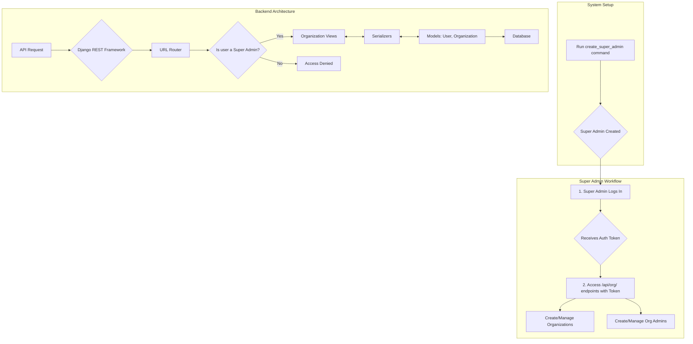

# Project Flow Diagram

This diagram illustrates the current architecture and Super Admin workflow of the application.

```mermaid
graph TD
    subgraph "System Setup"
        A[Run create_super_admin command] --> B{Super Admin Created};
    end

    subgraph "Super Admin Workflow"
        C[1. Super Admin Logs In] --> D{Receives Auth Token};
        D --> E[2. Access /api/org/ endpoints with Token];
        E --> F[Create/Manage Organizations];
        E --> G[Create/Manage Org Admins];
    end

    subgraph "Backend Architecture"
        H[API Request] --> I{Django REST Framework};
        I --> J[URL Router];
        J --> K{"Is user a Super Admin?"};
        K -- Yes --> L[Organization Views];
        K -- No --> M[Access Denied];
        L <--> N[Serializers];
        N <--> O[Models: User, Organization];
        O --> P[Database];
    end
    
    B --> C;
``` 