# Backend_PRS - System Architecture Documentation

## Table of Contents
1. [System Overview](#system-overview)
2. [Technology Stack](#technology-stack)
3. [Overall Architecture](#overall-architecture)
4. [Application Architecture](#application-architecture)
5. [Database Architecture](#database-architecture)
6. [API Architecture](#api-architecture)
7. [Security Architecture](#security-architecture)
8. [Real-time Features](#real-time-features)
9. [Data Flow Diagrams](#data-flow-diagrams)
10. [Sequence Diagrams](#sequence-diagrams)
11. [Component Relationships](#component-relationships)
12. [Deployment Architecture](#deployment-architecture)
13. [Performance & Scalability](#performance--scalability)

---

## System Overview

Backend_PRS is a comprehensive **Multi-Tenant SaaS Platform** designed for Personal Revenue System management. It implements a sophisticated architecture supporting multiple organizations with complete data isolation, real-time notifications, payment processing, and advanced analytics.

### Key Features
- **Multi-tenant Architecture** with organization-based data isolation
- **Role-based Access Control** (RBAC) system
- **Real-time Notifications** via WebSocket
- **Payment Processing** with verification workflows
- **Sales Analytics** and performance tracking
- **Commission Management** with automatic calculations
- **Audit Logging** and compliance tracking

---

## Technology Stack

### Backend Framework
```
Django 5.2.2                    # Main web framework
Django REST Framework 3.15.2    # API framework
Django Channels 4.0.0           # WebSocket/async support
Daphne 4.0.0                    # ASGI server
```

### Database & Storage
```
PostgreSQL                      # Primary production database
SQLite                          # Development fallback
Redis                           # Caching, sessions, WebSocket layer
Cloudinary                      # Media storage and CDN
```

### Security & Authentication
```
JWT Token Authentication        # API authentication
Multi-factor Authentication     # Admin security
Role-based Access Control       # Permission system
Organization-based Multi-tenancy # Data isolation
```

### Deployment & Infrastructure
```
Render.com                      # Primary deployment platform
Gunicorn/Daphne                 # Production ASGI server
WhiteNoise                      # Static file serving
Docker                          # Containerization support
```

---

## Overall Architecture

### High-Level System Architecture

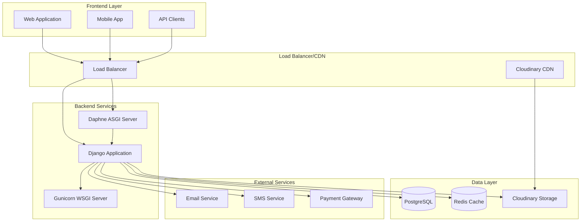

### Multi-Tenant Architecture Pattern

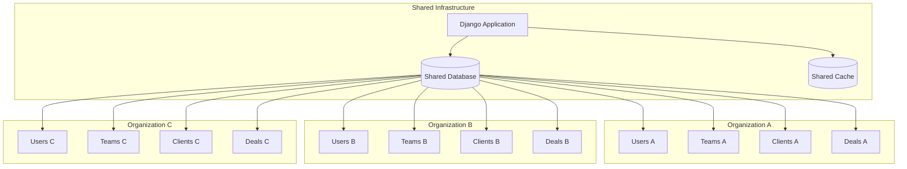

---

## Application Architecture

### Django Apps Structure

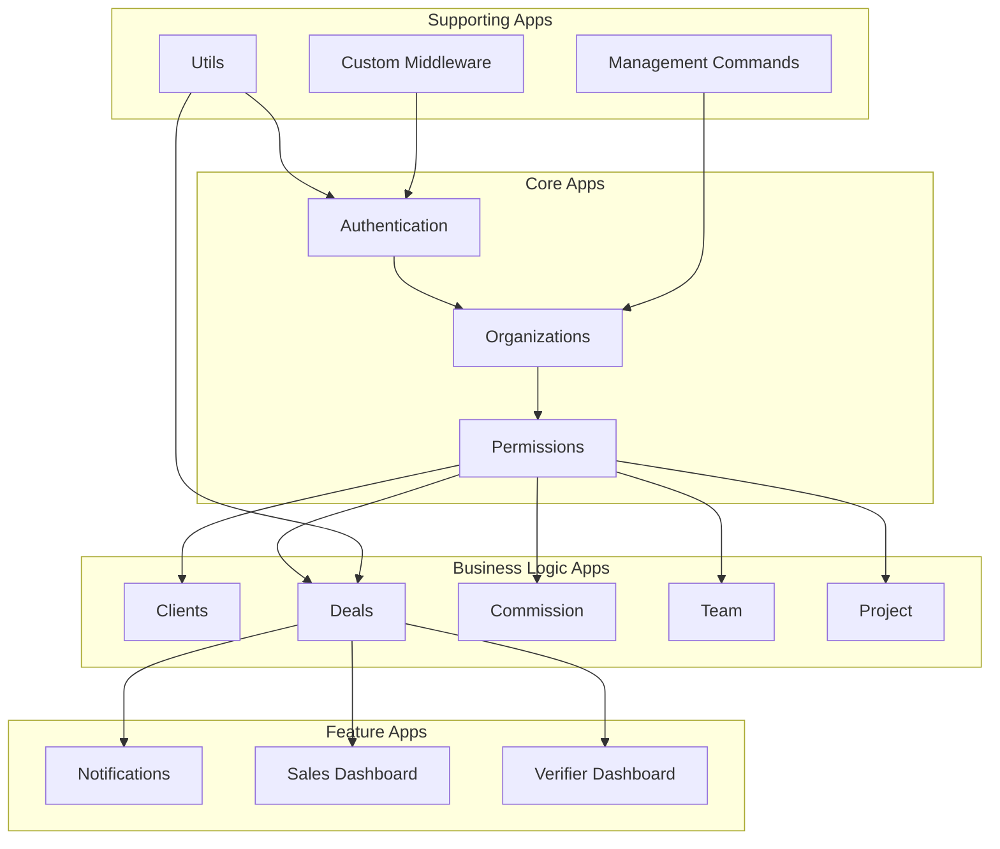

### Application Layer Architecture

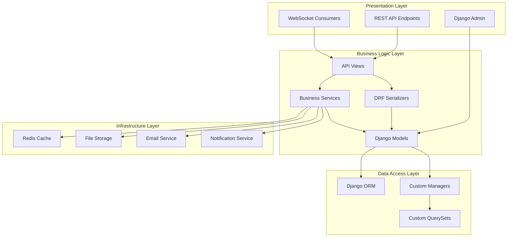

---

## Database Architecture

### Entity Relationship Diagram

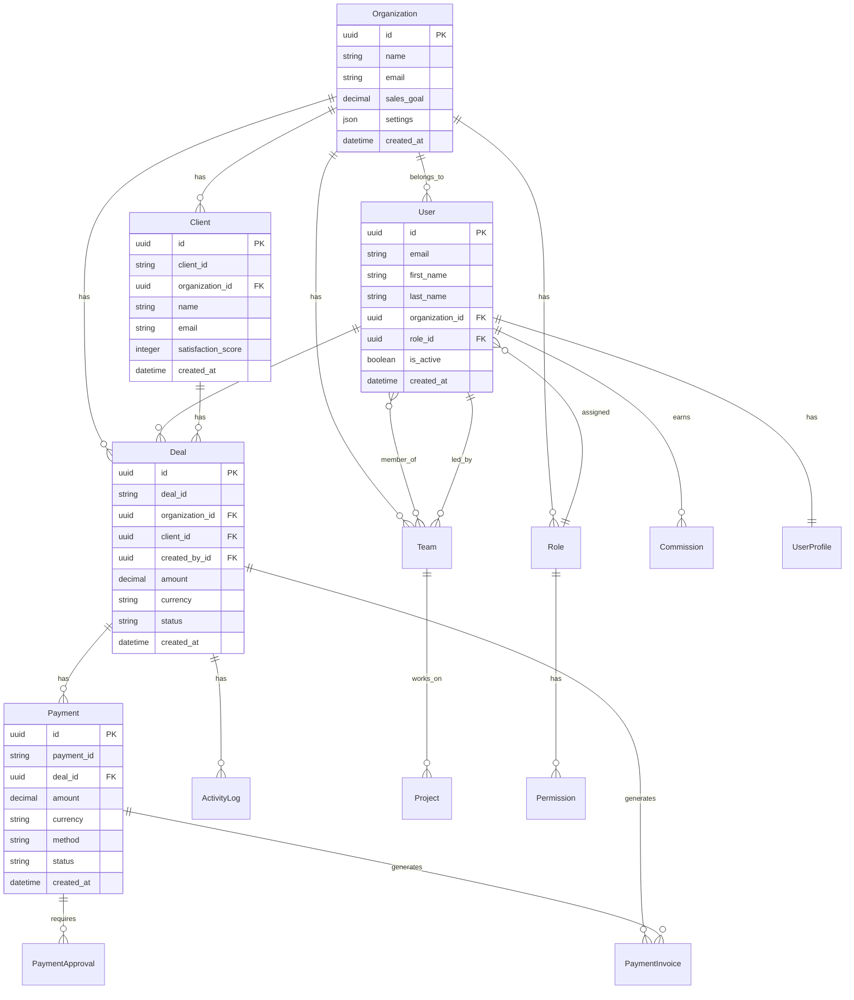

### Database Schema Patterns

```mermaid
graph TB
    subgraph "Multi-tenancy Pattern"
        ORG_FILTER[Organization Filter]
        DATA_ISOLATION[Data Isolation]
        TENANT_AWARE[Tenant-Aware Queries]
    end

    subgraph "Audit Pattern"
        AUDIT_LOG[Activity Log]
        TIMESTAMP[Timestamps]
        USER_TRACKING[User Tracking]
    end

    subgraph "Security Pattern"
        UUID_PK[UUID Primary Keys]
        SOFT_DELETE[Soft Deletes]
        ENCRYPTION[Field Encryption]
    end

    subgraph "Performance Pattern"
        INDEXES[Strategic Indexes]
        QUERY_OPT[Query Optimization]
        CACHING[Database Caching]
    end

    ORG_FILTER --> DATA_ISOLATION
    DATA_ISOLATION --> TENANT_AWARE
    
    AUDIT_LOG --> TIMESTAMP
    TIMESTAMP --> USER_TRACKING
    
    UUID_PK --> SOFT_DELETE
    SOFT_DELETE --> ENCRYPTION
    
    INDEXES --> QUERY_OPT
    QUERY_OPT --> CACHING
```

---

## API Architecture

### RESTful API Structure

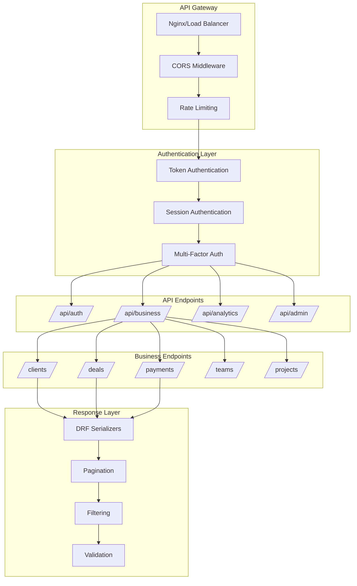

### API Response Structure

```json
{
    "success": true,
    "data": {
        "results": [...],
        "pagination": {
            "count": 100,
            "next": "url",
            "previous": "url",
            "page_size": 20
        }
    },
    "meta": {
        "timestamp": "2024-01-01T00:00:00Z",
        "version": "1.0",
        "request_id": "uuid"
    }
}
```

---

## Security Architecture

### Security Layers

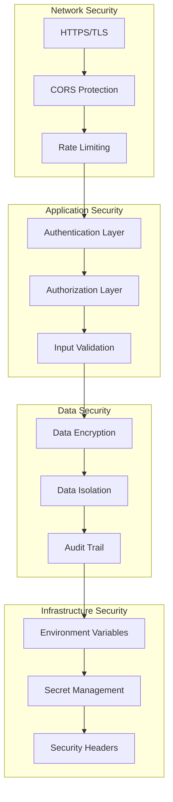

### Authentication & Authorization Flow

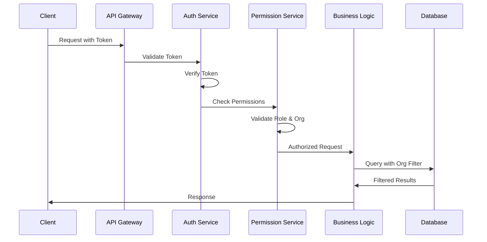

---

## Real-time Features

### WebSocket Architecture

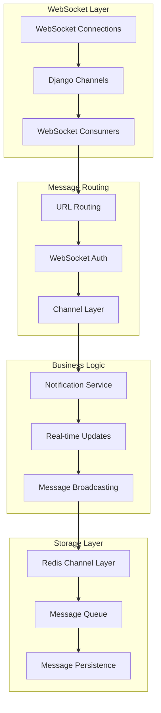

### Real-time Notification Flow

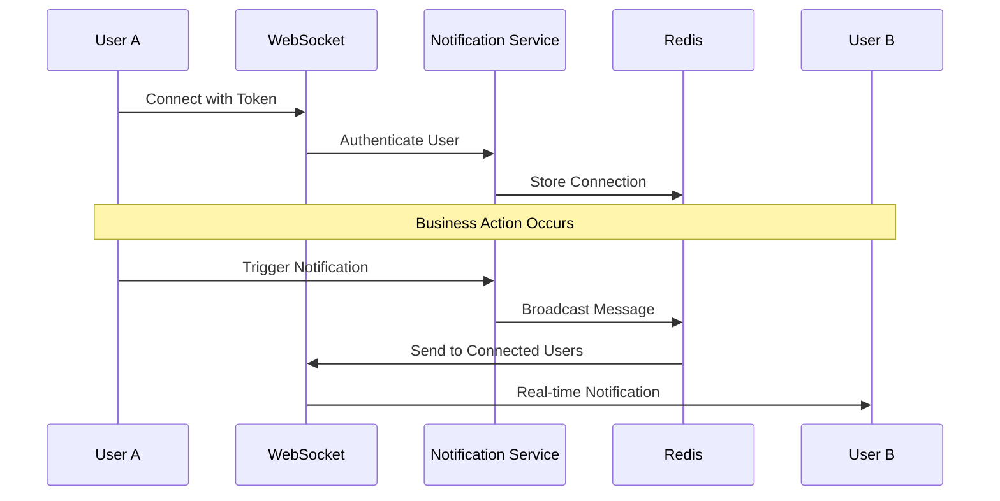

---

## Data Flow Diagrams

### Deal Processing Flow

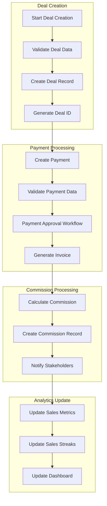

### User Authentication Flow

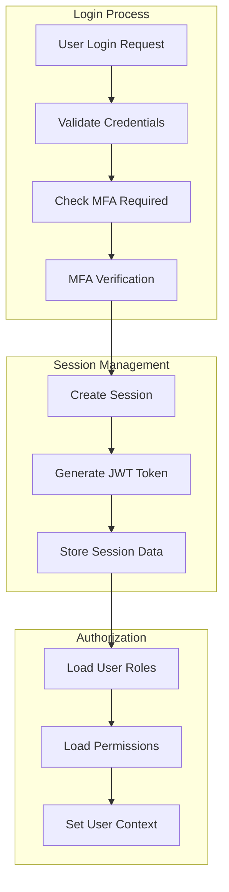

---

## Sequence Diagrams

### Deal Creation Sequence

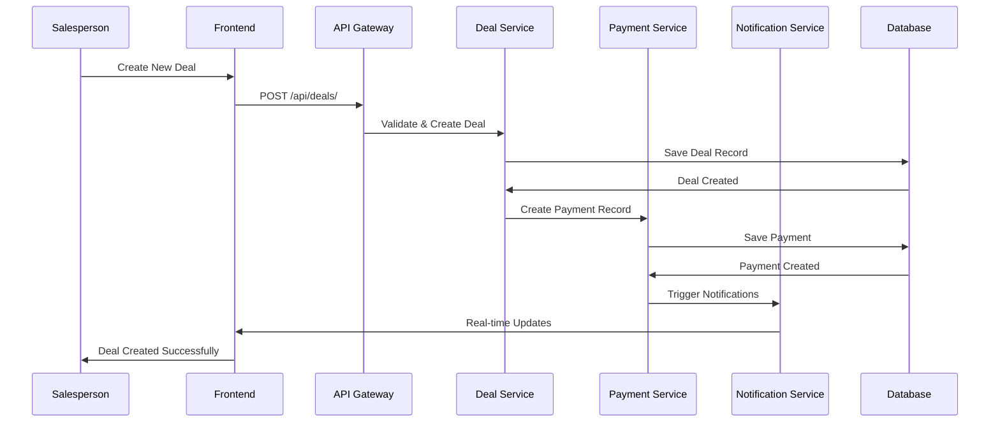

### Payment Approval Sequence

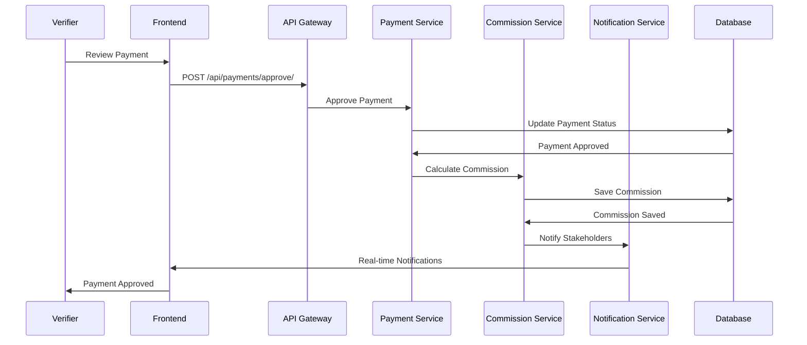

### Real-time Notification Sequence

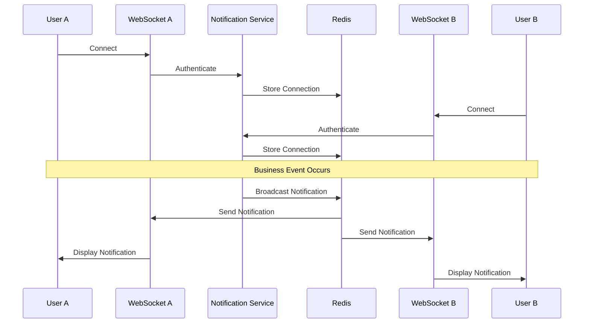

---

## Component Relationships

### Core Component Interaction

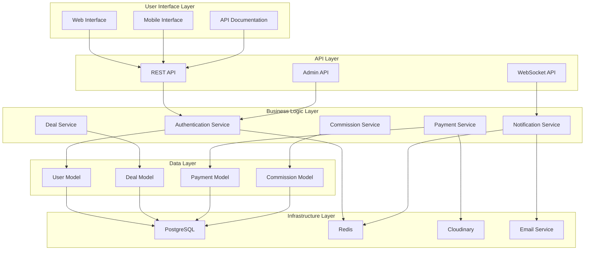

### Inter-Service Communication

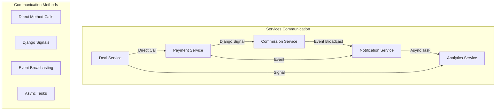

---

## Deployment Architecture

### Production Deployment

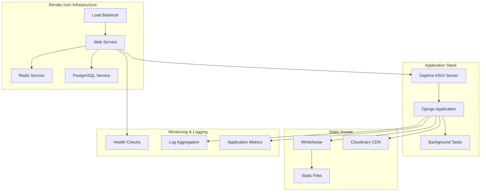

### Environment Configuration

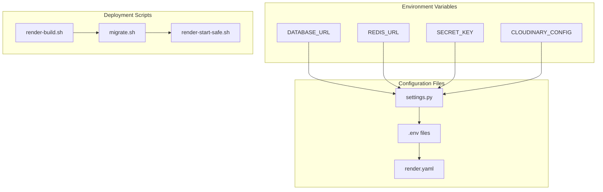

---

## Performance & Scalability

### Performance Optimization Strategy

```mermaid
graph TB
    subgraph "Database Optimization"
        INDEXES[Strategic Indexes]
        QUERY_OPT[Query Optimization]
        CONNECTION_POOL[Connection Pooling]
    end

    subgraph "Caching Strategy"
        REDIS_CACHE[Redis Caching]
        QUERY_CACHE[Query Caching]
        TEMPLATE_CACHE[Template Caching]
    end

    subgraph "Application Optimization"
        ASYNC_TASKS[Async Task Processing]
        LAZY_LOADING[Lazy Loading]
        BULK_OPERATIONS[Bulk Operations]
    end

    subgraph "Infrastructure Optimization"
        CDN[Content Delivery Network]
        LOAD_BALANCING[Load Balancing]
        AUTO_SCALING[Auto Scaling]
    end

    INDEXES --> QUERY_OPT
    QUERY_OPT --> CONNECTION_POOL
    CONNECTION_POOL --> REDIS_CACHE
    
    REDIS_CACHE --> QUERY_CACHE
    QUERY_CACHE --> TEMPLATE_CACHE
    TEMPLATE_CACHE --> ASYNC_TASKS
    
    ASYNC_TASKS --> LAZY_LOADING
    LAZY_LOADING --> BULK_OPERATIONS
    BULK_OPERATIONS --> CDN
    
    CDN --> LOAD_BALANCING
    LOAD_BALANCING --> AUTO_SCALING
```

### Scalability Considerations

```mermaid
graph TB
    subgraph "Horizontal Scaling"
        MULTI_INSTANCE[Multiple App Instances]
        LOAD_BALANCER[Load Balancer]
        STATELESS_DESIGN[Stateless Design]
    end

    subgraph "Vertical Scaling"
        CPU_SCALING[CPU Scaling]
        MEMORY_SCALING[Memory Scaling]
        STORAGE_SCALING[Storage Scaling]
    end

    subgraph "Database Scaling"
        READ_REPLICAS[Read Replicas]
        PARTITIONING[Data Partitioning]
        SHARDING[Database Sharding]
    end

    subgraph "Caching Scaling"
        REDIS_CLUSTER[Redis Cluster]
        CACHE_LAYERS[Multiple Cache Layers]
        CACHE_WARMING[Cache Warming]
    end

    MULTI_INSTANCE --> LOAD_BALANCER
    LOAD_BALANCER --> STATELESS_DESIGN
    
    CPU_SCALING --> MEMORY_SCALING
    MEMORY_SCALING --> STORAGE_SCALING
    
    READ_REPLICAS --> PARTITIONING
    PARTITIONING --> SHARDING
    
    REDIS_CLUSTER --> CACHE_LAYERS
    CACHE_LAYERS --> CACHE_WARMING
```

---

## Key Business Workflows

### Sales Process Workflow

```mermaid
graph TB
    START[Start Sales Process]
    CLIENT_CONTACT[Client Contact]
    DEAL_NEGOTIATION[Deal Negotiation]
    DEAL_CREATION[Deal Creation]
    PAYMENT_PROCESSING[Payment Processing]
    VERIFICATION[Payment Verification]
    COMMISSION_CALC[Commission Calculation]
    ANALYTICS_UPDATE[Analytics Update]
    END[Process Complete]

    START --> CLIENT_CONTACT
    CLIENT_CONTACT --> DEAL_NEGOTIATION
    DEAL_NEGOTIATION --> DEAL_CREATION
    DEAL_CREATION --> PAYMENT_PROCESSING
    PAYMENT_PROCESSING --> VERIFICATION
    VERIFICATION --> COMMISSION_CALC
    COMMISSION_CALC --> ANALYTICS_UPDATE
    ANALYTICS_UPDATE --> END
```

### Commission Processing Workflow

```mermaid
graph TB
    PAYMENT_APPROVED[Payment Approved]
    VALIDATE_DEAL[Validate Deal]
    CALCULATE_BASE[Calculate Base Commission]
    APPLY_BONUSES[Apply Performance Bonuses]
    DEDUCT_PENALTIES[Deduct Penalties]
    CREATE_COMMISSION[Create Commission Record]
    NOTIFY_SALESPERSON[Notify Salesperson]
    UPDATE_ANALYTICS[Update Analytics]

    PAYMENT_APPROVED --> VALIDATE_DEAL
    VALIDATE_DEAL --> CALCULATE_BASE
    CALCULATE_BASE --> APPLY_BONUSES
    APPLY_BONUSES --> DEDUCT_PENALTIES
    DEDUCT_PENALTIES --> CREATE_COMMISSION
    CREATE_COMMISSION --> NOTIFY_SALESPERSON
    NOTIFY_SALESPERSON --> UPDATE_ANALYTICS
```

---

## Conclusion

The Backend_PRS system is built with a modern, scalable architecture that supports:

- **Multi-tenancy** with complete data isolation
- **Real-time features** for enhanced user experience
- **Comprehensive security** with multiple layers of protection
- **Flexible payment processing** with approval workflows
- **Advanced analytics** and reporting capabilities
- **Scalable infrastructure** ready for enterprise deployment

This architecture provides a solid foundation for a growing SaaS business while maintaining security, performance, and maintainability standards.

---

## Appendices

### A. Technology Versions
- Django: 5.2.2
- Django REST Framework: 3.15.2
- Django Channels: 4.0.0
- PostgreSQL: Latest
- Redis: Latest
- Python: 3.11+

### B. Key Environment Variables
```
DATABASE_URL=postgresql://...
REDIS_URL=redis://...
SECRET_KEY=...
CLOUDINARY_URL=...
DEBUG=False
ALLOWED_HOSTS=...
```

### C. Important Management Commands
```bash
python manage.py initialize_app          # Initialize application
python manage.py create_super_admin      # Create super admin
python manage.py setup_permissions       # Setup permissions
python manage.py calculate_streaks       # Calculate sales streaks
python manage.py collectstatic          # Collect static files
python manage.py migrate                # Run migrations
```