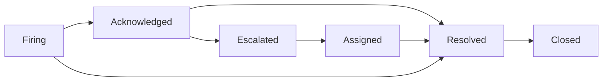
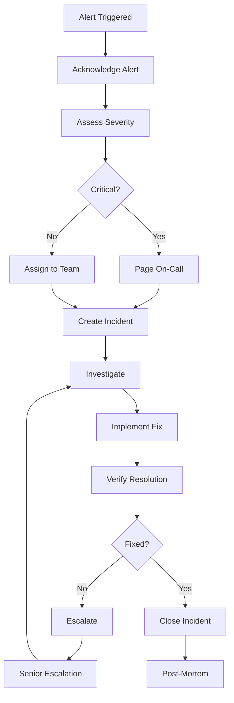

# Alerting Procedures and Runbooks

## Overview

This guide provides comprehensive alerting procedures, incident response runbooks, and troubleshooting guides for the Payment Receiving System (PRS) Backend. It covers alert configuration, escalation procedures, and step-by-step resolution guides.

---

## 📋 Table of Contents

1. [Alert Management Overview](#alert-management-overview)
2. [Alert Configuration](#alert-configuration)
3. [Incident Response Procedures](#incident-response-procedures)
4. [Service-Specific Runbooks](#service-specific-runbooks)
5. [Escalation Procedures](#escalation-procedures)
6. [Post-Incident Procedures](#post-incident-procedures)

---

## 🚨 Alert Management Overview

### Alert Severity Levels

| Severity | Response Time | Description | Examples |
|----------|---------------|-------------|----------|
| **🔴 Critical** | Immediate (5 min) | Service unavailable or data loss | Service down, database failure |
| **🟡 Warning** | 30 minutes | Degraded performance | High response time, resource usage |
| **🟢 Info** | Next business day | Informational only | Deployment completed, maintenance |

### Alert States



### On-Call Schedule

| Role | Primary Hours | Backup | Escalation |
|------|---------------|---------|------------|
| **Platform Engineer** | 24/7 | DevOps Team | Engineering Manager |
| **Database Admin** | Business Hours | On-Call DBA | Infrastructure Lead |
| **Security Engineer** | 24/7 | Security Team | CISO |
| **Product Owner** | Business Hours | Engineering Manager | Director |

---

## ⚙️ Alert Configuration

### 1. AlertManager Configuration

```yaml
# /etc/alertmanager/alertmanager.yml

global:
  smtp_smarthost: 'localhost:587'
  smtp_from: 'alerts@yourdomain.com'
  slack_api_url: 'https://hooks.slack.com/services/YOUR/SLACK/WEBHOOK'

# Email templates
templates:
  - '/etc/alertmanager/templates/*.tmpl'

# Routing rules
route:
  group_by: ['alertname', 'service']
  group_wait: 10s
  group_interval: 10s
  repeat_interval: 1h
  receiver: 'default'
  
  routes:
  # Critical alerts - immediate response
  - match:
      severity: critical
    receiver: 'critical-alerts'
    group_wait: 0s
    repeat_interval: 5m
    
  # Security alerts - always escalate
  - match:
      service: security
    receiver: 'security-team'
    group_wait: 0s
    repeat_interval: 15m
    
  # Database alerts - specialized handling
  - match:
      service: postgresql
    receiver: 'database-team'
    repeat_interval: 30m
    
  # Business hours vs after hours
  - match_re:
      severity: warning|info
    receiver: 'business-hours'
    active_time_intervals:
      - business_hours
    
  # After hours warning escalation
  - match:
      severity: warning
    receiver: 'after-hours-escalation'
    active_time_intervals:
      - after_hours

# Time intervals
time_intervals:
  - name: business_hours
    time_intervals:
      - times:
        - start_time: '09:00'
          end_time: '17:00'
        weekdays: ['monday:friday']
        
  - name: after_hours
    time_intervals:
      - times:
        - start_time: '17:00'
          end_time: '09:00'
        weekdays: ['monday:friday']
      - weekdays: ['saturday', 'sunday']

# Receivers
receivers:
  - name: 'default'
    slack_configs:
      - api_url: '{{ template "slack.api_url" . }}'
        channel: '#alerts'
        title: 'PRS Alert'
        text: '{{ range .Alerts }}{{ .Annotations.summary }}{{ end }}'

  - name: 'critical-alerts'
    slack_configs:
      - api_url: '{{ template "slack.api_url" . }}'
        channel: '#critical-alerts'
        title: '🚨 CRITICAL: PRS Alert'
        text: '{{ range .Alerts }}{{ .Annotations.summary }}\n{{ .Annotations.description }}{{ end }}'
        actions:
          - type: button
            text: 'Acknowledge'
            url: '{{ template "slack.acknowledge_url" . }}'
          - type: button
            text: 'Runbook'
            url: '{{ template "slack.runbook_url" . }}'
    
    email_configs:
      - to: 'oncall@yourdomain.com'
        subject: '🚨 CRITICAL: {{ .GroupLabels.alertname }}'
        body: |
          Alert: {{ .GroupLabels.alertname }}
          Severity: {{ .CommonLabels.severity }}
          Service: {{ .CommonLabels.service }}
          
          {{ range .Alerts }}
          Summary: {{ .Annotations.summary }}
          Description: {{ .Annotations.description }}
          Instance: {{ .Labels.instance }}
          {{ end }}
          
          Runbook: https://runbooks.yourdomain.com/{{ .GroupLabels.alertname }}
    
    pagerduty_configs:
      - routing_key: 'YOUR_PAGERDUTY_INTEGRATION_KEY'
        description: '{{ .GroupLabels.alertname }}: {{ .CommonAnnotations.summary }}'

  - name: 'security-team'
    slack_configs:
      - api_url: '{{ template "slack.api_url" . }}'
        channel: '#security-alerts'
        title: '🔒 SECURITY ALERT'
        text: '{{ range .Alerts }}{{ .Annotations.summary }}{{ end }}'
    
    email_configs:
      - to: 'security-team@yourdomain.com'
        subject: '🔒 Security Alert: {{ .GroupLabels.alertname }}'

  - name: 'database-team'
    slack_configs:
      - api_url: '{{ template "slack.api_url" . }}'
        channel: '#database-alerts'
        title: '🗄️ Database Alert'
        text: '{{ range .Alerts }}{{ .Annotations.summary }}{{ end }}'
    
    email_configs:
      - to: 'dba-team@yourdomain.com'
        subject: '🗄️ Database Alert: {{ .GroupLabels.alertname }}'

# Inhibition rules (suppress redundant alerts)
inhibit_rules:
  # Suppress warning if critical is firing
  - source_match:
      severity: 'critical'
    target_match:
      severity: 'warning'
    equal: ['alertname', 'instance']

  # Suppress individual service alerts if general service down
  - source_match:
      alertname: 'ServiceDown'
    target_match_re:
      alertname: '^(HighResponseTime|HighErrorRate|DatabaseSlow)$'
    equal: ['instance']
```

### 2. Slack Integration Setup

```python
# scripts/alerting/slack_webhook.py

import json
import requests
from datetime import datetime
from typing import Dict, List, Optional

class SlackNotifier:
    """Enhanced Slack notification system"""
    
    def __init__(self, webhook_url: str, default_channel: str = "#alerts"):
        self.webhook_url = webhook_url
        self.default_channel = default_channel
    
    def send_alert(self, alert_data: Dict, channel: Optional[str] = None) -> bool:
        """Send alert notification to Slack"""
        
        channel = channel or self.default_channel
        severity = alert_data.get('severity', 'info')
        
        # Color coding by severity
        color_map = {
            'critical': '#FF0000',  # Red
            'warning': '#FFA500',   # Orange
            'info': '#00FF00'       # Green
        }
        
        # Emoji mapping
        emoji_map = {
            'critical': '🚨',
            'warning': '⚠️',
            'info': 'ℹ️'
        }
        
        payload = {
            "channel": channel,
            "username": "PRS Monitoring",
            "icon_emoji": ":warning:",
            "attachments": [
                {
                    "color": color_map.get(severity, '#808080'),
                    "pretext": f"{emoji_map.get(severity, '🔔')} *{severity.upper()} Alert*",
                    "title": alert_data.get('alertname', 'Unknown Alert'),
                    "text": alert_data.get('summary', ''),
                    "fields": [
                        {
                            "title": "Service",
                            "value": alert_data.get('service', 'Unknown'),
                            "short": True
                        },
                        {
                            "title": "Instance",
                            "value": alert_data.get('instance', 'Unknown'),
                            "short": True
                        },
                        {
                            "title": "Description",
                            "value": alert_data.get('description', ''),
                            "short": False
                        },
                        {
                            "title": "Time",
                            "value": datetime.now().strftime('%Y-%m-%d %H:%M:%S UTC'),
                            "short": True
                        }
                    ],
                    "actions": [
                        {
                            "type": "button",
                            "text": "📚 Runbook",
                            "url": f"https://runbooks.yourdomain.com/{alert_data.get('alertname', '').lower().replace(' ', '-')}"
                        },
                        {
                            "type": "button",
                            "text": "📊 Dashboard",
                            "url": "https://grafana.yourdomain.com/d/prs-overview"
                        },
                        {
                            "type": "button",
                            "text": "🔍 Logs",
                            "url": "https://kibana.yourdomain.com"
                        }
                    ],
                    "footer": "PRS Monitoring System",
                    "ts": int(datetime.now().timestamp())
                }
            ]
        }
        
        try:
            response = requests.post(self.webhook_url, json=payload, timeout=10)
            response.raise_for_status()
            return True
            
        except requests.exceptions.RequestException as e:
            print(f"Failed to send Slack notification: {e}")
            return False
    
    def send_incident_summary(self, incident_data: Dict) -> bool:
        """Send incident summary to Slack"""
        
        payload = {
            "channel": "#incidents",
            "username": "PRS Incident Manager",
            "attachments": [
                {
                    "color": "#FF0000" if incident_data.get('severity') == 'critical' else "#FFA500",
                    "title": f"Incident #{incident_data.get('incident_id')}: {incident_data.get('title')}",
                    "fields": [
                        {
                            "title": "Status",
                            "value": incident_data.get('status', 'Open'),
                            "short": True
                        },
                        {
                            "title": "Assigned To",
                            "value": incident_data.get('assigned_to', 'Unassigned'),
                            "short": True
                        },
                        {
                            "title": "Duration",
                            "value": incident_data.get('duration', 'Ongoing'),
                            "short": True
                        },
                        {
                            "title": "Impact",
                            "value": incident_data.get('impact', 'Unknown'),
                            "short": True
                        }
                    ]
                }
            ]
        }
        
        return self._send_payload(payload)
    
    def _send_payload(self, payload: Dict) -> bool:
        """Send payload to Slack webhook"""
        try:
            response = requests.post(self.webhook_url, json=payload, timeout=10)
            response.raise_for_status()
            return True
        except requests.exceptions.RequestException:
            return False

# Usage example
if __name__ == "__main__":
    notifier = SlackNotifier("YOUR_WEBHOOK_URL")
    
    alert = {
        "alertname": "HighResponseTime",
        "severity": "warning",
        "service": "prs-backend",
        "instance": "prs-backend-1",
        "summary": "Response time is above threshold",
        "description": "95th percentile response time is 3.2s"
    }
    
    notifier.send_alert(alert, "#alerts")
```

---

## 🚑 Incident Response Procedures

### 1. Incident Classification

#### Severity 1 - Critical (P1)
- **Definition**: Complete service outage or data loss
- **Response Time**: Immediate (5 minutes)
- **Examples**: 
  - API completely down
  - Database unavailable
  - Security breach
  - Data corruption

#### Severity 2 - Major (P2)
- **Definition**: Significant functionality impaired
- **Response Time**: 30 minutes
- **Examples**:
  - Key features not working
  - Performance severely degraded
  - Partial service outage

#### Severity 3 - Minor (P3)
- **Definition**: Minor functionality impaired
- **Response Time**: 2 hours
- **Examples**:
  - Non-critical features affected
  - Cosmetic issues
  - Monitoring alerts

### 2. Incident Response Workflow



### 3. Incident Response Scripts

```bash
#!/bin/bash
# scripts/incident/incident-response.sh

set -e

INCIDENT_ID=${1:-$(date +%Y%m%d%H%M%S)}
SEVERITY=${2:-"unknown"}
DESCRIPTION=${3:-"No description provided"}

echo "🚨 INCIDENT RESPONSE INITIATED"
echo "==============================="
echo "Incident ID: $INCIDENT_ID"
echo "Severity: $SEVERITY"
echo "Description: $DESCRIPTION"
echo "Time: $(date)"

# Create incident directory
INCIDENT_DIR="/var/log/incidents/$INCIDENT_ID"
mkdir -p "$INCIDENT_DIR"

# Initialize incident log
INCIDENT_LOG="$INCIDENT_DIR/incident.log"
echo "Incident ID: $INCIDENT_ID" > "$INCIDENT_LOG"
echo "Started: $(date)" >> "$INCIDENT_LOG"
echo "Severity: $SEVERITY" >> "$INCIDENT_LOG"
echo "Description: $DESCRIPTION" >> "$INCIDENT_LOG"
echo "====================================" >> "$INCIDENT_LOG"

# Function to log incident actions
log_action() {
    echo "[$(date)] $1" | tee -a "$INCIDENT_LOG"
}

# Initial assessment
log_action "🔍 Starting initial assessment"

# Check service health
log_action "📊 Checking service health"
curl -s http://localhost:8000/api/health/ > "$INCIDENT_DIR/health_check.json" || {
    log_action "❌ Health check failed"
}

# Collect system metrics
log_action "📈 Collecting system metrics"
{
    echo "=== SYSTEM STATUS ==="
    uptime
    echo ""
    echo "=== MEMORY USAGE ==="
    free -h
    echo ""
    echo "=== DISK USAGE ==="
    df -h
    echo ""
    echo "=== CPU USAGE ==="
    top -bn1 | head -20
    echo ""
    echo "=== NETWORK CONNECTIONS ==="
    netstat -an | grep :8000
} > "$INCIDENT_DIR/system_status.txt"

# Collect application logs
log_action "📋 Collecting application logs"
tail -n 1000 /var/log/prs/django.log > "$INCIDENT_DIR/django_logs.txt" || {
    log_action "⚠️  Could not collect Django logs"
}

tail -n 1000 /var/log/prs/security.log > "$INCIDENT_DIR/security_logs.txt" || {
    log_action "⚠️  Could not collect security logs"
}

# Database status
log_action "🗄️ Checking database status"
python manage.py dbshell --command="
    SELECT 
        count(*) as active_connections,
        (SELECT count(*) FROM pg_stat_activity WHERE state = 'active') as active_queries,
        (SELECT count(*) FROM pg_stat_activity WHERE query_start < now() - interval '1 minute') as long_queries
    ;
" > "$INCIDENT_DIR/database_status.txt" || {
    log_action "❌ Database check failed"
}

# Send notification
log_action "📢 Sending incident notification"
if command -v curl >/dev/null 2>&1; then
    curl -X POST "${SLACK_WEBHOOK_URL}" \
        -H 'Content-type: application/json' \
        --data "{
            \"text\": \"🚨 Incident $INCIDENT_ID Created\",
            \"blocks\": [
                {
                    \"type\": \"section\",
                    \"text\": {
                        \"type\": \"mrkdwn\",
                        \"text\": \"*Incident ID:* $INCIDENT_ID\n*Severity:* $SEVERITY\n*Description:* $DESCRIPTION\n*Time:* $(date)\"
                    }
                },
                {
                    \"type\": \"actions\",
                    \"elements\": [
                        {
                            \"type\": \"button\",
                            \"text\": {
                                \"type\": \"plain_text\",
                                \"text\": \"View Logs\"
                            },
                            \"url\": \"https://kibana.yourdomain.com\"
                        },
                        {
                            \"type\": \"button\",
                            \"text\": {
                                \"type\": \"plain_text\",
                                \"text\": \"Dashboard\"
                            },
                            \"url\": \"https://grafana.yourdomain.com\"
                        }
                    ]
                }
            ]
        }" || log_action "⚠️  Failed to send Slack notification"
fi

log_action "✅ Incident response initialization completed"
log_action "📁 Incident data collected in: $INCIDENT_DIR"

echo ""
echo "🔗 Next Steps:"
echo "1. Review collected data in $INCIDENT_DIR"
echo "2. Follow appropriate runbook for the issue"
echo "3. Update incident status as investigation progresses"
echo "4. Use: ./update-incident-status.sh $INCIDENT_ID <status> <message>"
```

### 4. Incident Update Script

```bash
#!/bin/bash
# scripts/incident/update-incident-status.sh

INCIDENT_ID=${1}
STATUS=${2}
MESSAGE=${3}

if [ -z "$INCIDENT_ID" ] || [ -z "$STATUS" ] || [ -z "$MESSAGE" ]; then
    echo "Usage: $0 <incident_id> <status> <message>"
    echo "Status: investigating|identified|monitoring|resolved"
    exit 1
fi

INCIDENT_DIR="/var/log/incidents/$INCIDENT_ID"
INCIDENT_LOG="$INCIDENT_DIR/incident.log"

if [ ! -f "$INCIDENT_LOG" ]; then
    echo "❌ Incident $INCIDENT_ID not found"
    exit 1
fi

# Log the update
echo "[$(date)] STATUS UPDATE: $STATUS - $MESSAGE" >> "$INCIDENT_LOG"

# Send status update notification
curl -X POST "${SLACK_WEBHOOK_URL}" \
    -H 'Content-type: application/json' \
    --data "{
        \"text\": \"📋 Incident $INCIDENT_ID Status Update\",
        \"blocks\": [
            {
                \"type\": \"section\",
                \"text\": {
                    \"type\": \"mrkdwn\",
                    \"text\": \"*Incident:* $INCIDENT_ID\n*Status:* $STATUS\n*Update:* $MESSAGE\n*Time:* $(date)\"
                }
            }
        ]
    }" || echo "⚠️  Failed to send status update notification"

echo "✅ Incident $INCIDENT_ID status updated to: $STATUS"
```

---

## 📚 Service-Specific Runbooks

### 1. Application Service Down

**Alert**: `ServiceDown`  
**Severity**: Critical  
**Response Time**: Immediate (5 minutes)

#### Investigation Steps

1. **Check Service Health**
```bash
# Check if service is responding
curl -I http://localhost:8000/api/health/

# Check process status
ps aux | grep gunicorn
systemctl status prs-backend

# Check recent logs
tail -f /var/log/prs/django.log
```

2. **Check Infrastructure**
```bash
# Check disk space
df -h

# Check memory usage
free -h

# Check CPU usage
top -bn1

# Check network connectivity
ping google.com
```

3. **Check Dependencies**
```bash
# Check database connectivity
python manage.py dbshell --command="SELECT 1;"

# Check Redis connectivity
redis-cli ping

# Check external services
curl -I https://api.external-service.com/health
```

#### Resolution Steps

1. **Quick Fixes**
```bash
# Restart service
systemctl restart prs-backend

# Or with Docker
docker-compose restart app

# Clear any locks
rm -f /tmp/prs.lock
```

2. **If Database Issues**
```bash
# Check database connections
python manage.py dbshell --command="
    SELECT count(*) FROM pg_stat_activity;
    SELECT * FROM pg_stat_activity WHERE state = 'active';
"

# Kill long-running queries if needed
python manage.py dbshell --command="
    SELECT pg_terminate_backend(pid) 
    FROM pg_stat_activity 
    WHERE query_start < now() - interval '5 minutes';
"
```

3. **If Memory Issues**
```bash
# Check memory usage by process
ps aux --sort=-%mem | head -20

# Clear caches if safe
echo 3 > /proc/sys/vm/drop_caches

# Restart service with memory monitoring
systemctl restart prs-backend
watch -n 5 'ps aux | grep gunicorn'
```

#### Escalation Criteria
- Service cannot be restarted within 10 minutes
- Database corruption suspected
- Multiple services affected
- Security incident suspected

### 2. High Response Time

**Alert**: `HighResponseTime`  
**Severity**: Warning  
**Response Time**: 30 minutes

#### Investigation Steps

1. **Check Current Performance**
```bash
# Check response times
curl -w "@curl-format.txt" -o /dev/null -s http://localhost:8000/api/health/

# Check active connections
netstat -an | grep :8000 | wc -l

# Check load average
uptime
```

2. **Database Performance**
```bash
# Check slow queries
python manage.py dbshell --command="
    SELECT query, query_start, now() - query_start AS duration 
    FROM pg_stat_activity 
    WHERE state = 'active' 
    ORDER BY duration DESC;
"

# Check database locks
python manage.py dbshell --command="
    SELECT * FROM pg_locks WHERE NOT granted;
"
```

3. **Application Metrics**
```bash
# Check Gunicorn workers
ps aux | grep gunicorn | wc -l

# Check memory per worker
ps aux --sort=-%mem | grep gunicorn
```

#### Resolution Steps

1. **Scale Application**
```bash
# Increase Gunicorn workers
systemctl edit prs-backend
# Add: Environment=GUNICORN_WORKERS=6

systemctl restart prs-backend
```

2. **Database Optimization**
```bash
# Kill slow queries
python manage.py dbshell --command="
    SELECT pg_terminate_backend(pid) 
    FROM pg_stat_activity 
    WHERE query_start < now() - interval '2 minutes'
    AND state = 'active';
"

# Update statistics
python manage.py dbshell --command="ANALYZE;"
```

3. **Clear Caches**
```bash
# Clear application cache
python manage.py shell -c "from django.core.cache import cache; cache.clear()"

# Restart Redis if needed
systemctl restart redis
```

### 3. Database Connection Issues

**Alert**: `DatabaseConnectionHigh`  
**Severity**: Warning  
**Response Time**: 15 minutes

#### Investigation Steps

1. **Check Connection Count**
```sql
-- Current connections
SELECT count(*) FROM pg_stat_activity;

-- Connections by state
SELECT state, count(*) FROM pg_stat_activity GROUP BY state;

-- Long-running connections
SELECT pid, usename, application_name, client_addr, query_start, state, query 
FROM pg_stat_activity 
WHERE query_start < now() - interval '1 minute'
ORDER BY query_start;
```

2. **Check Database Health**
```sql
-- Check for locks
SELECT * FROM pg_locks WHERE NOT granted;

-- Check database size
SELECT pg_database_size(current_database());

-- Check for blocking queries
SELECT blocked_locks.pid AS blocked_pid,
       blocked_activity.usename AS blocked_user,
       blocking_locks.pid AS blocking_pid,
       blocking_activity.usename AS blocking_user,
       blocked_activity.query AS blocked_statement,
       blocking_activity.query AS current_statement_in_blocking_process
FROM pg_catalog.pg_locks blocked_locks
JOIN pg_catalog.pg_stat_activity blocked_activity ON blocked_activity.pid = blocked_locks.pid
JOIN pg_catalog.pg_locks blocking_locks ON (blocking_locks.locktype = blocked_locks.locktype
    AND blocking_locks.database IS NOT DISTINCT FROM blocked_locks.database
    AND blocking_locks.relation IS NOT DISTINCT FROM blocked_locks.relation)
JOIN pg_catalog.pg_stat_activity blocking_activity ON blocking_activity.pid = blocking_locks.pid
WHERE NOT blocked_locks.granted;
```

#### Resolution Steps

1. **Kill Problematic Connections**
```sql
-- Kill idle connections older than 1 hour
SELECT pg_terminate_backend(pid)
FROM pg_stat_activity
WHERE state = 'idle'
AND query_start < now() - interval '1 hour';

-- Kill long-running queries (carefully!)
SELECT pg_terminate_backend(pid)
FROM pg_stat_activity
WHERE query_start < now() - interval '5 minutes'
AND state = 'active'
AND query NOT LIKE '%pg_stat_activity%';
```

2. **Application-Side Fixes**
```bash
# Restart application to reset connection pool
systemctl restart prs-backend

# Check Django database settings
python manage.py shell -c "
from django.conf import settings
print('CONN_MAX_AGE:', settings.DATABASES['default'].get('CONN_MAX_AGE'))
"
```

### 4. Security Alert Response

**Alert**: Various security alerts  
**Severity**: Critical  
**Response Time**: Immediate (5 minutes)

#### Investigation Steps

1. **Identify Threat Type**
```bash
# Check security logs
grep -i "security" /var/log/prs/security.log | tail -50

# Check authentication failures
grep -i "authentication.*failed" /var/log/prs/django.log | tail -20

# Check unusual access patterns
grep -E "HTTP/[0-9.]+ (4[0-9]{2}|5[0-9]{2})" /var/log/nginx/access.log | tail -20
```

2. **Check for Brute Force Attacks**
```bash
# Check failed login attempts
awk '{print $1}' /var/log/nginx/access.log | sort | uniq -c | sort -nr | head -10

# Check for rapid requests from single IP
grep "$(date +%d/%b/%Y)" /var/log/nginx/access.log | \
    awk '{print $1}' | sort | uniq -c | sort -nr | head -10
```

3. **Check System Integrity**
```bash
# Check for unusual processes
ps aux | grep -v "grep\|ps" | sort -k3 -nr

# Check network connections
netstat -tulpn | grep LISTEN

# Check file modifications
find /etc -mtime -1 -ls
```

#### Response Actions

1. **Immediate Containment**
```bash
# Block suspicious IPs (example)
iptables -A INPUT -s SUSPICIOUS_IP -j DROP

# Temporarily restrict access
# Modify nginx config to allow only known IPs
```

2. **Evidence Collection**
```bash
# Create incident directory
INCIDENT_DIR="/var/log/security_incident_$(date +%Y%m%d_%H%M%S)"
mkdir -p "$INCIDENT_DIR"

# Copy relevant logs
cp /var/log/prs/security.log "$INCIDENT_DIR/"
cp /var/log/nginx/access.log "$INCIDENT_DIR/"
cp /var/log/auth.log "$INCIDENT_DIR/"

# System snapshot
ps aux > "$INCIDENT_DIR/processes.txt"
netstat -tulpn > "$INCIDENT_DIR/network.txt"
```

3. **Escalation**
```bash
# Notify security team immediately
curl -X POST "${SECURITY_WEBHOOK_URL}" \
    -H 'Content-type: application/json' \
    --data "{
        \"text\": \"🔒 SECURITY INCIDENT DETECTED\",
        \"blocks\": [
            {
                \"type\": \"section\",
                \"text\": {
                    \"type\": \"mrkdwn\",
                    \"text\": \"*SECURITY ALERT*\nImmediate attention required\nEvidence collected in: $INCIDENT_DIR\"
                }
            }
        ]
    }"
```

---

## 📞 Escalation Procedures

### 1. Escalation Matrix

| Time Elapsed | Action | Contact |
|--------------|---------|---------|
| **0-5 min** | Primary on-call acknowledges | Platform Engineer |
| **15 min** | If no acknowledgment | Backup Engineer |
| **30 min** | If no resolution progress | Engineering Manager |
| **1 hour** | If still unresolved (Critical) | Director of Engineering |
| **2 hours** | If major customer impact | VP of Engineering + Customer Success |

### 2. Escalation Script

```bash
#!/bin/bash
# scripts/incident/escalate-incident.sh

INCIDENT_ID=${1}
ESCALATION_LEVEL=${2:-1}

if [ -z "$INCIDENT_ID" ]; then
    echo "Usage: $0 <incident_id> [escalation_level]"
    exit 1
fi

INCIDENT_DIR="/var/log/incidents/$INCIDENT_ID"
INCIDENT_LOG="$INCIDENT_DIR/incident.log"

if [ ! -f "$INCIDENT_LOG" ]; then
    echo "❌ Incident $INCIDENT_ID not found"
    exit 1
fi

# Log escalation
echo "[$(date)] ESCALATED to Level $ESCALATION_LEVEL" >> "$INCIDENT_LOG"

# Determine escalation contacts
case $ESCALATION_LEVEL in
    1)
        CONTACTS="engineering-manager@yourdomain.com"
        SLACK_CHANNEL="#engineering-escalation"
        TITLE="🚨 Incident Escalated to Engineering Manager"
        ;;
    2)
        CONTACTS="director-engineering@yourdomain.com,engineering-manager@yourdomain.com"
        SLACK_CHANNEL="#leadership-alerts"
        TITLE="🔥 CRITICAL: Incident Escalated to Director"
        ;;
    3)
        CONTACTS="vp-engineering@yourdomain.com,director-engineering@yourdomain.com,ceo@yourdomain.com"
        SLACK_CHANNEL="#executive-alerts"
        TITLE="🚨 URGENT: Executive Escalation Required"
        ;;
esac

# Send escalation notification
curl -X POST "${SLACK_WEBHOOK_URL}" \
    -H 'Content-type: application/json' \
    --data "{
        \"channel\": \"$SLACK_CHANNEL\",
        \"text\": \"$TITLE\",
        \"blocks\": [
            {
                \"type\": \"section\",
                \"text\": {
                    \"type\": \"mrkdwn\",
                    \"text\": \"*Incident ID:* $INCIDENT_ID\n*Escalation Level:* $ESCALATION_LEVEL\n*Time:* $(date)\n\n*Summary:* $(tail -n 5 "$INCIDENT_LOG" | head -n 1)\"
                }
            },
            {
                \"type\": \"actions\",
                \"elements\": [
                    {
                        \"type\": \"button\",
                        \"text\": {
                            \"type\": \"plain_text\",
                            \"text\": \"Take Ownership\"
                        },
                        \"action_id\": \"take_ownership_$INCIDENT_ID\"
                    }
                ]
            }
        ]
    }"

# Send email notification
{
    echo "Subject: $TITLE - Incident $INCIDENT_ID"
    echo "To: $CONTACTS"
    echo ""
    echo "Incident ID: $INCIDENT_ID"
    echo "Escalation Level: $ESCALATION_LEVEL"
    echo "Time: $(date)"
    echo ""
    echo "Recent Activity:"
    tail -n 10 "$INCIDENT_LOG"
    echo ""
    echo "Incident Details: https://runbooks.yourdomain.com/incident/$INCIDENT_ID"
} | sendmail $CONTACTS

echo "✅ Incident $INCIDENT_ID escalated to Level $ESCALATION_LEVEL"
```

---

## 📝 Post-Incident Procedures

### 1. Incident Resolution Script

```bash
#!/bin/bash
# scripts/incident/resolve-incident.sh

INCIDENT_ID=${1}
RESOLUTION_SUMMARY=${2:-"Issue resolved"}

if [ -z "$INCIDENT_ID" ]; then
    echo "Usage: $0 <incident_id> [resolution_summary]"
    exit 1
fi

INCIDENT_DIR="/var/log/incidents/$INCIDENT_ID"
INCIDENT_LOG="$INCIDENT_DIR/incident.log"

if [ ! -f "$INCIDENT_LOG" ]; then
    echo "❌ Incident $INCIDENT_ID not found"
    exit 1
fi

# Log resolution
{
    echo "[$(date)] RESOLVED: $RESOLUTION_SUMMARY"
    echo "Resolution Time: $(date)"
    echo "===================================="
} >> "$INCIDENT_LOG"

# Calculate incident duration
START_TIME=$(grep "Started:" "$INCIDENT_LOG" | cut -d' ' -f2-)
END_TIME=$(date)
echo "Duration: $(date -d "$END_TIME" +%s) - $(date -d "$START_TIME" +%s) = $(($(date -d "$END_TIME" +%s) - $(date -d "$START_TIME" +%s))) seconds" >> "$INCIDENT_LOG"

# Send resolution notification
curl -X POST "${SLACK_WEBHOOK_URL}" \
    -H 'Content-type: application/json' \
    --data "{
        \"text\": \"✅ Incident $INCIDENT_ID Resolved\",
        \"blocks\": [
            {
                \"type\": \"section\",
                \"text\": {
                    \"type\": \"mrkdwn\",
                    \"text\": \"*Incident:* $INCIDENT_ID\n*Status:* Resolved\n*Summary:* $RESOLUTION_SUMMARY\n*Time:* $(date)\"
                }
            },
            {
                \"type\": \"section\",
                \"text\": {
                    \"type\": \"mrkdwn\",
                    \"text\": \"*Next Steps:*\n• Post-mortem scheduled\n• Documentation updated\n• Monitoring reviewed\"
                }
            }
        ]
    }"

# Schedule post-mortem
echo "📋 Post-mortem required for incident $INCIDENT_ID"
echo "   - Schedule meeting within 24-48 hours"
echo "   - Include all responders"
echo "   - Focus on prevention and process improvement"

echo "✅ Incident $INCIDENT_ID marked as resolved"
```

### 2. Post-Mortem Template

```markdown
# Post-Mortem: Incident [INCIDENT_ID]

**Date**: [DATE]  
**Duration**: [START_TIME] - [END_TIME] ([DURATION])  
**Severity**: [SEVERITY]  
**Impact**: [DESCRIPTION OF IMPACT]  

## Summary

Brief description of what happened and the impact on users/systems.

## Timeline

| Time | Event |
|------|-------|
| [TIME] | [EVENT DESCRIPTION] |
| [TIME] | [EVENT DESCRIPTION] |

## Root Cause

Detailed analysis of what caused the incident.

## Resolution

Steps taken to resolve the incident.

## Action Items

| Action | Owner | Due Date | Status |
|--------|-------|----------|---------|
| [ACTION] | [PERSON] | [DATE] | [STATUS] |

## Lessons Learned

### What Went Well
- [ITEM]

### What Could Be Improved
- [ITEM]

### Prevention Measures
- [ITEM]

## Monitoring/Alerting Improvements

- [IMPROVEMENT]

## Process Improvements

- [IMPROVEMENT]

---
**Created**: [DATE]  
**Attendees**: [LIST OF ATTENDEES]
```

This comprehensive alerting and runbooks guide provides detailed procedures for incident response, service-specific troubleshooting, and post-incident analysis to ensure effective operational support for the PRS backend system.
