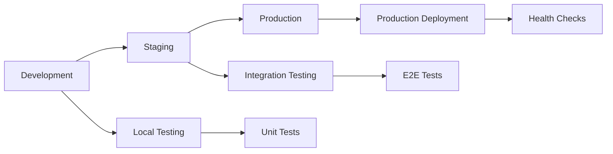

# Database Migration Procedures

## Overview

This guide provides comprehensive procedures for managing database migrations in the Payment Receiving System (PRS) Backend across all environments. It covers migration strategies, safety procedures, rollback mechanisms, and troubleshooting guidelines.

---

## 📋 Table of Contents

1. [Migration Strategy](#migration-strategy)
2. [Pre-Migration Procedures](#pre-migration-procedures)
3. [Migration Execution](#migration-execution)
4. [Post-Migration Verification](#post-migration-verification)
5. [Rollback Procedures](#rollback-procedures)
6. [Zero-Downtime Migrations](#zero-downtime-migrations)
7. [Data Migration Procedures](#data-migration-procedures)
8. [Troubleshooting](#troubleshooting)

---

## 🎯 Migration Strategy

### Migration Types

| Type | Description | Risk Level | Downtime | Examples |
|------|-------------|------------|----------|----------|
| **Schema-Only** | Structure changes without data | Low | Minimal | Adding indexes, constraints |
| **Additive** | Adding new columns/tables | Low | None | New features, optional fields |
| **Destructive** | Removing/altering existing data | High | Planned | Column removal, data type changes |
| **Data Migration** | Large-scale data transformations | Medium | Variable | Data restructuring, cleanup |

### Migration Environments Flow



### Migration Safety Levels

#### Level 1: Safe (Green) 🟢
- Adding new tables
- Adding new columns (nullable)
- Adding indexes (concurrent)
- Creating new constraints (not validated)

#### Level 2: Caution (Yellow) 🟡
- Renaming columns/tables
- Adding non-null columns with defaults
- Dropping indexes
- Altering column types (compatible)

#### Level 3: Dangerous (Red) 🔴
- Dropping columns/tables
- Changing column types (incompatible)
- Large data migrations
- Adding unique constraints

---

## 🛡️ Pre-Migration Procedures

### 1. Migration Planning Checklist

```bash
#!/bin/bash
# pre-migration-checklist.sh

set -e

echo "🔍 Pre-Migration Checklist"
echo "=========================="

# Variables
ENVIRONMENT=${1:-production}
DRY_RUN=${2:-true}

# Check current migration status
echo "📋 Current migration status:"
python manage.py showmigrations --verbosity=2

# Check for unapplied migrations
UNAPPLIED=$(python manage.py showmigrations | grep "\[ \]" | wc -l)
echo "🔢 Unapplied migrations: $UNAPPLIED"

# Estimate migration impact
echo "⏱️ Estimating migration impact..."
python manage.py sqlmigrate --verbosity=2 $(python manage.py showmigrations | grep "\[ \]" | head -1 | awk '{print $2, $3}') || echo "No pending migrations"

# Check database size
echo "💾 Database size analysis:"
python manage.py dbshell << 'EOF'
SELECT 
    schemaname,
    tablename,
    pg_size_pretty(pg_total_relation_size(schemaname||'.'||tablename)) as size,
    pg_total_relation_size(schemaname||'.'||tablename) as bytes
FROM pg_tables 
WHERE schemaname = 'public'
ORDER BY bytes DESC
LIMIT 10;
EOF

# Check for blocking processes
echo "🚦 Checking for long-running queries:"
python manage.py dbshell << 'EOF'
SELECT 
    pid,
    now() - pg_stat_activity.query_start AS duration,
    query,
    state
FROM pg_stat_activity
WHERE pg_stat_activity.query <> ''
    AND now() - pg_stat_activity.query_start > interval '1 minute'
ORDER BY duration DESC;
EOF

# Validate migrations
echo "✅ Validating migrations..."
python manage.py check --database default

if [ "$DRY_RUN" = "false" ]; then
    echo "⚠️  DRY RUN DISABLED - Migrations will be applied!"
else
    echo "🧪 DRY RUN MODE - No migrations will be applied"
fi

echo "✅ Pre-migration checks completed"
```

### 2. Database Backup Procedure

```bash
#!/bin/bash
# backup-database.sh

set -e

# Configuration
DB_HOST=${DB_HOST:-localhost}
DB_NAME=${DB_NAME:-prs_production}
DB_USER=${DB_USER:-prs_admin}
BACKUP_DIR=${BACKUP_DIR:-/var/backups/postgresql}
S3_BUCKET=${S3_BUCKET:-prs-database-backups}
RETENTION_DAYS=${RETENTION_DAYS:-30}

# Generate backup filename
TIMESTAMP=$(date +%Y%m%d_%H%M%S)
BACKUP_FILE="$BACKUP_DIR/${DB_NAME}_backup_$TIMESTAMP.sql"
BACKUP_CUSTOM="$BACKUP_DIR/${DB_NAME}_backup_$TIMESTAMP.backup"

echo "🗄️ Starting database backup..."
echo "📊 Database: $DB_NAME on $DB_HOST"
echo "📁 Backup directory: $BACKUP_DIR"

# Create backup directory
mkdir -p "$BACKUP_DIR"

# Check available disk space
AVAILABLE_SPACE=$(df -BG "$BACKUP_DIR" | awk 'NR==2 {print $4}' | sed 's/G//')
if [ "$AVAILABLE_SPACE" -lt 10 ]; then
    echo "⚠️  Warning: Low disk space ($AVAILABLE_SPACE GB available)"
fi

# Get database size
DB_SIZE=$(psql -h "$DB_HOST" -U "$DB_USER" -d "$DB_NAME" -t -c "SELECT pg_size_pretty(pg_database_size('$DB_NAME'));" | tr -d ' ')
echo "💾 Database size: $DB_SIZE"

# Create SQL dump (text format)
echo "📄 Creating SQL dump..."
pg_dump -h "$DB_HOST" -U "$DB_USER" -d "$DB_NAME" \
    --verbose \
    --clean \
    --create \
    --if-exists \
    --format=plain \
    --file="$BACKUP_FILE" \
    --no-password

# Create custom format backup (compressed)
echo "📦 Creating compressed backup..."
pg_dump -h "$DB_HOST" -U "$DB_USER" -d "$DB_NAME" \
    --verbose \
    --format=custom \
    --compress=9 \
    --file="$BACKUP_CUSTOM" \
    --no-password

# Verify backups
echo "✅ Verifying backups..."
if [ ! -f "$BACKUP_FILE" ] || [ ! -s "$BACKUP_FILE" ]; then
    echo "❌ SQL backup failed or is empty"
    exit 1
fi

if [ ! -f "$BACKUP_CUSTOM" ] || [ ! -s "$BACKUP_CUSTOM" ]; then
    echo "❌ Custom backup failed or is empty"
    exit 1
fi

# Calculate checksums
echo "🔍 Calculating checksums..."
SQL_CHECKSUM=$(md5sum "$BACKUP_FILE" | awk '{print $1}')
CUSTOM_CHECKSUM=$(md5sum "$BACKUP_CUSTOM" | awk '{print $1}')

echo "📋 Backup summary:"
echo "   SQL Backup: $(basename "$BACKUP_FILE") ($(du -h "$BACKUP_FILE" | cut -f1))"
echo "   Custom Backup: $(basename "$BACKUP_CUSTOM") ($(du -h "$BACKUP_CUSTOM" | cut -f1))"
echo "   SQL Checksum: $SQL_CHECKSUM"
echo "   Custom Checksum: $CUSTOM_CHECKSUM"

# Upload to S3 if configured
if [ -n "$S3_BUCKET" ] && command -v aws >/dev/null 2>&1; then
    echo "☁️ Uploading to S3..."
    
    aws s3 cp "$BACKUP_FILE" "s3://$S3_BUCKET/$(basename "$BACKUP_FILE")" \
        --storage-class STANDARD_IA
    
    aws s3 cp "$BACKUP_CUSTOM" "s3://$S3_BUCKET/$(basename "$BACKUP_CUSTOM")" \
        --storage-class STANDARD_IA
    
    # Create metadata file
    cat > "$BACKUP_DIR/backup_$TIMESTAMP.json" << EOF
{
    "timestamp": "$TIMESTAMP",
    "database": "$DB_NAME",
    "host": "$DB_HOST",
    "size": "$DB_SIZE",
    "sql_file": "$(basename "$BACKUP_FILE")",
    "custom_file": "$(basename "$BACKUP_CUSTOM")",
    "sql_checksum": "$SQL_CHECKSUM",
    "custom_checksum": "$CUSTOM_CHECKSUM",
    "s3_bucket": "$S3_BUCKET"
}
EOF
    
    aws s3 cp "$BACKUP_DIR/backup_$TIMESTAMP.json" "s3://$S3_BUCKET/metadata/"
    
    echo "✅ Backup uploaded to S3"
fi

# Clean up old backups
echo "🧹 Cleaning up old backups..."
find "$BACKUP_DIR" -name "${DB_NAME}_backup_*.sql" -mtime +$RETENTION_DAYS -delete
find "$BACKUP_DIR" -name "${DB_NAME}_backup_*.backup" -mtime +$RETENTION_DAYS -delete
find "$BACKUP_DIR" -name "backup_*.json" -mtime +$RETENTION_DAYS -delete

echo "✅ Database backup completed successfully"
echo "📁 Backup files:"
echo "   $BACKUP_FILE"
echo "   $BACKUP_CUSTOM"
```

### 3. Migration Impact Assessment

```python
#!/usr/bin/env python3
"""
assess-migration-impact.py

Analyzes migration impact and estimates execution time.
"""

import os
import sys
import django
from django.core.management import execute_from_command_line
from django.db import connection
from django.apps import apps

# Setup Django
os.environ.setdefault("DJANGO_SETTINGS_MODULE", "core_config.settings.production")
django.setup()

def analyze_table_sizes():
    """Analyze table sizes to estimate migration impact"""
    with connection.cursor() as cursor:
        cursor.execute("""
            SELECT 
                schemaname,
                tablename,
                pg_size_pretty(pg_total_relation_size(schemaname||'.'||tablename)) as size,
                pg_total_relation_size(schemaname||'.'||tablename) as bytes,
                n_tup_ins + n_tup_upd + n_tup_del as total_changes
            FROM pg_tables 
            LEFT JOIN pg_stat_user_tables ON pg_tables.tablename = pg_stat_user_tables.relname
            WHERE schemaname = 'public'
            ORDER BY bytes DESC;
        """)
        
        tables = cursor.fetchall()
        
        print("📊 Table Size Analysis:")
        print("=" * 80)
        print(f"{'Table':<30} {'Size':<15} {'Bytes':<15} {'Activity':<15}")
        print("-" * 80)
        
        for table in tables:
            schema, name, size, bytes_size, activity = table
            activity_str = str(activity) if activity else "0"
            print(f"{name:<30} {size:<15} {bytes_size:<15} {activity_str:<15}")

def analyze_pending_migrations():
    """Analyze pending migrations and their complexity"""
    from django.db.migrations.executor import MigrationExecutor
    from django.db.migrations.loader import MigrationLoader
    
    executor = MigrationExecutor(connection)
    loader = MigrationLoader(connection)
    
    # Get migration plan
    plan = executor.migration_plan(executor.loader.graph.leaf_nodes())
    
    if not plan:
        print("✅ No pending migrations")
        return
    
    print(f"📋 Pending Migrations ({len(plan)} total):")
    print("=" * 80)
    
    total_risk_score = 0
    
    for migration, backwards in plan:
        app_label = migration.app_label
        migration_name = migration.name
        
        # Load migration file to analyze operations
        try:
            migration_obj = loader.get_migration(app_label, migration_name)
            operations = migration_obj.operations
            
            risk_score = 0
            operation_types = []
            
            for operation in operations:
                op_type = operation.__class__.__name__
                operation_types.append(op_type)
                
                # Calculate risk score based on operation type
                if op_type in ['CreateModel', 'AddField']:
                    risk_score += 1  # Low risk
                elif op_type in ['AlterField', 'RenameField', 'AddIndex']:
                    risk_score += 2  # Medium risk
                elif op_type in ['RemoveField', 'DeleteModel', 'RunSQL']:
                    risk_score += 3  # High risk
                elif op_type == 'RunPython':
                    risk_score += 4  # Very high risk
            
            risk_level = "🟢 Low" if risk_score <= 2 else "🟡 Medium" if risk_score <= 5 else "🔴 High"
            
            print(f"App: {app_label}")
            print(f"Migration: {migration_name}")
            print(f"Operations: {', '.join(operation_types)}")
            print(f"Risk Level: {risk_level} (Score: {risk_score})")
            print("-" * 40)
            
            total_risk_score += risk_score
            
        except Exception as e:
            print(f"⚠️  Could not analyze migration {app_label}.{migration_name}: {e}")
    
    overall_risk = "🟢 Low" if total_risk_score <= 5 else "🟡 Medium" if total_risk_score <= 15 else "🔴 High"
    print(f"\n📊 Overall Migration Risk: {overall_risk} (Total Score: {total_risk_score})")
    
    # Provide recommendations
    print("\n💡 Recommendations:")
    if total_risk_score <= 5:
        print("   - Safe to apply during normal maintenance window")
        print("   - Minimal downtime expected")
    elif total_risk_score <= 15:
        print("   - Schedule during low-traffic period")
        print("   - Prepare rollback plan")
        print("   - Consider extended maintenance window")
    else:
        print("   - ⚠️  HIGH RISK: Plan carefully")
        print("   - Test thoroughly in staging environment")
        print("   - Prepare detailed rollback procedures")
        print("   - Consider breaking into smaller migrations")
        print("   - Schedule during extended maintenance window")

def estimate_migration_time():
    """Estimate migration execution time based on table sizes and operations"""
    print("\n⏱️ Migration Time Estimates:")
    print("=" * 50)
    
    with connection.cursor() as cursor:
        # Get total database size
        cursor.execute("SELECT pg_size_pretty(pg_database_size(current_database()));")
        db_size = cursor.fetchone()[0]
        
        # Get total row count
        cursor.execute("""
            SELECT SUM(n_tup_ins + n_tup_upd) as total_rows 
            FROM pg_stat_user_tables;
        """)
        total_rows = cursor.fetchone()[0] or 0
        
        print(f"Database Size: {db_size}")
        print(f"Total Rows: {total_rows:,}")
        
        # Rough estimates based on database size and operations
        if total_rows < 100000:
            print("Estimated Time: < 1 minute")
        elif total_rows < 1000000:
            print("Estimated Time: 1-5 minutes")
        elif total_rows < 10000000:
            print("Estimated Time: 5-30 minutes")
        else:
            print("Estimated Time: 30+ minutes")
            print("⚠️  Consider zero-downtime migration strategies")

def check_migration_blockers():
    """Check for potential migration blockers"""
    print("\n🚦 Checking for Migration Blockers:")
    print("=" * 50)
    
    with connection.cursor() as cursor:
        # Check for long-running queries
        cursor.execute("""
            SELECT 
                pid,
                now() - pg_stat_activity.query_start AS duration,
                state,
                query
            FROM pg_stat_activity
            WHERE pg_stat_activity.query <> ''
                AND now() - pg_stat_activity.query_start > interval '5 minutes'
            ORDER BY duration DESC;
        """)
        
        long_queries = cursor.fetchall()
        
        if long_queries:
            print("⚠️  Long-running queries detected:")
            for query in long_queries:
                pid, duration, state, sql = query
                print(f"   PID {pid}: {duration} - {state}")
                print(f"   Query: {sql[:100]}...")
        else:
            print("✅ No long-running queries detected")
        
        # Check for locked tables
        cursor.execute("""
            SELECT 
                t.relname,
                l.locktype,
                l.mode,
                l.granted
            FROM pg_locks l
            JOIN pg_class t ON l.relation = t.oid
            WHERE t.relkind = 'r'
                AND NOT l.granted;
        """)
        
        locked_tables = cursor.fetchall()
        
        if locked_tables:
            print("🔒 Locked tables detected:")
            for table, locktype, mode, granted in locked_tables:
                print(f"   {table}: {locktype} ({mode}) - Granted: {granted}")
        else:
            print("✅ No table locks detected")

def main():
    """Main assessment function"""
    print("🔍 Migration Impact Assessment")
    print("=" * 50)
    
    analyze_table_sizes()
    analyze_pending_migrations()
    estimate_migration_time()
    check_migration_blockers()
    
    print("\n✅ Migration impact assessment completed")
    print("\n💡 Next Steps:")
    print("   1. Review the analysis above")
    print("   2. Create database backup")
    print("   3. Test migrations in staging environment")
    print("   4. Plan maintenance window if needed")
    print("   5. Prepare rollback procedures")

if __name__ == '__main__':
    main()
```

---

## ▶️ Migration Execution

### 1. Standard Migration Procedure

```bash
#!/bin/bash
# execute-migration.sh

set -e

# Configuration
ENVIRONMENT=${1:-production}
DRY_RUN=${2:-true}
BACKUP=${3:-true}
LOG_FILE="/var/log/prs/migration_$(date +%Y%m%d_%H%M%S).log"

echo "🚀 Starting database migration process" | tee -a "$LOG_FILE"
echo "Environment: $ENVIRONMENT" | tee -a "$LOG_FILE"
echo "Dry Run: $DRY_RUN" | tee -a "$LOG_FILE"
echo "Backup: $BACKUP" | tee -a "$LOG_FILE"
echo "Log File: $LOG_FILE" | tee -a "$LOG_FILE"
echo "Timestamp: $(date)" | tee -a "$LOG_FILE"

# Function to log with timestamp
log() {
    echo "[$(date +'%Y-%m-%d %H:%M:%S')] $1" | tee -a "$LOG_FILE"
}

# Function to handle errors
handle_error() {
    log "❌ ERROR: Migration failed at step: $1"
    log "📋 Current migration status:"
    python manage.py showmigrations | tee -a "$LOG_FILE"
    
    # Send alert
    if command -v curl >/dev/null 2>&1; then
        curl -X POST "${SLACK_WEBHOOK_URL}" \
            -H 'Content-type: application/json' \
            --data "{\"text\":\"🚨 Database migration failed in $ENVIRONMENT: $1\"}" || true
    fi
    
    exit 1
}

# Trap errors
trap 'handle_error "Unknown error"' ERR

# Step 1: Pre-migration backup
if [ "$BACKUP" = "true" ]; then
    log "📦 Step 1: Creating pre-migration backup"
    ./scripts/deployment/backup-database.sh || handle_error "Backup creation"
else
    log "⚠️  Skipping backup as requested"
fi

# Step 2: Check current state
log "🔍 Step 2: Checking current migration state"
python manage.py check --database default || handle_error "Django check"
python manage.py showmigrations | tee -a "$LOG_FILE"

# Step 3: Migration impact assessment
log "📊 Step 3: Assessing migration impact"
python scripts/deployment/assess-migration-impact.py | tee -a "$LOG_FILE"

# Step 4: Apply migrations
if [ "$DRY_RUN" = "false" ]; then
    log "▶️ Step 4: Applying migrations (LIVE MODE)"
    
    # Record start time
    START_TIME=$(date +%s)
    
    # Apply migrations with verbose output
    python manage.py migrate --verbosity=2 | tee -a "$LOG_FILE" || handle_error "Migration execution"
    
    # Record end time
    END_TIME=$(date +%s)
    DURATION=$((END_TIME - START_TIME))
    
    log "✅ Migrations completed successfully in ${DURATION} seconds"
else
    log "🧪 Step 4: DRY RUN - Showing migration plan"
    python manage.py migrate --plan | tee -a "$LOG_FILE"
    log "💡 Use --dry-run=false to apply migrations"
fi

# Step 5: Post-migration verification
if [ "$DRY_RUN" = "false" ]; then
    log "✅ Step 5: Post-migration verification"
    
    # Check migration status
    python manage.py showmigrations | tee -a "$LOG_FILE"
    
    # Verify no pending migrations
    PENDING=$(python manage.py showmigrations | grep "\[ \]" | wc -l)
    if [ "$PENDING" -gt 0 ]; then
        handle_error "Migrations still pending after execution"
    fi
    
    # Run basic health check
    python manage.py check --database default || handle_error "Post-migration health check"
    
    # Test database connectivity
    python manage.py dbshell --command="SELECT version();" | tee -a "$LOG_FILE" || handle_error "Database connectivity test"
    
    log "🎉 Migration process completed successfully!"
    
    # Send success notification
    if command -v curl >/dev/null 2>&1; then
        curl -X POST "${SLACK_WEBHOOK_URL}" \
            -H 'Content-type: application/json' \
            --data "{\"text\":\"✅ Database migration completed successfully in $ENVIRONMENT (${DURATION}s)\"}" || true
    fi
else
    log "🧪 Dry run completed - no changes made"
fi

log "📁 Full log available at: $LOG_FILE"
```

### 2. Zero-Downtime Migration Strategy

```bash
#!/bin/bash
# zero-downtime-migration.sh

set -e

echo "🔄 Zero-Downtime Migration Strategy"
echo "=================================="

# Phase 1: Additive Changes (No Downtime)
echo "📈 Phase 1: Applying additive changes"
python manage.py migrate --verbosity=2 --run-syncdb

# Phase 2: Deploy New Code (Rolling Update)
echo "🚀 Phase 2: Deploying new application code"
# This would trigger your deployment pipeline
# The new code should be backward compatible with old schema

# Phase 3: Data Migration (Background)
echo "📊 Phase 3: Running data migration in background"
python manage.py migrate_data --background

# Phase 4: Verification
echo "✅ Phase 4: Verifying migration"
python manage.py verify_migration

# Phase 5: Cleanup (if needed)
echo "🧹 Phase 5: Cleanup old schema (if applicable)"
# This step removes old columns/tables that are no longer needed
# Only run after confirming the new code is stable
```

### 3. Large Data Migration

```python
#!/usr/bin/env python3
"""
data-migration-template.py

Template for large data migrations with progress tracking.
"""

import os
import sys
import time
from django.core.management.base import BaseCommand
from django.db import transaction, connection
from django.db.models import F

class Command(BaseCommand):
    help = 'Migrate large dataset with progress tracking'
    
    def add_arguments(self, parser):
        parser.add_argument('--batch-size', type=int, default=1000,
                          help='Number of records to process per batch')
        parser.add_argument('--delay', type=float, default=0.1,
                          help='Delay between batches (seconds)')
        parser.add_argument('--dry-run', action='store_true',
                          help='Show what would be migrated without making changes')
    
    def handle(self, *args, **options):
        batch_size = options['batch_size']
        delay = options['delay']
        dry_run = options['dry_run']
        
        self.stdout.write(f"🔄 Starting data migration")
        self.stdout.write(f"   Batch size: {batch_size}")
        self.stdout.write(f"   Delay: {delay}s")
        self.stdout.write(f"   Dry run: {dry_run}")
        
        if dry_run:
            self.stdout.write("🧪 DRY RUN MODE - No changes will be made")
        
        # Get total count
        total_count = self.get_total_count()
        self.stdout.write(f"📊 Total records to migrate: {total_count:,}")
        
        if total_count == 0:
            self.stdout.write("✅ No records to migrate")
            return
        
        # Process in batches
        processed = 0
        start_time = time.time()
        
        try:
            while processed < total_count:
                batch_start = time.time()
                
                # Process batch
                batch_count = self.process_batch(batch_size, dry_run)
                processed += batch_count
                
                batch_time = time.time() - batch_start
                progress_pct = (processed / total_count) * 100
                
                # Calculate ETA
                elapsed_time = time.time() - start_time
                if processed > 0:
                    avg_time_per_record = elapsed_time / processed
                    remaining_records = total_count - processed
                    eta_seconds = remaining_records * avg_time_per_record
                    eta_mins = eta_seconds / 60
                else:
                    eta_mins = 0
                
                self.stdout.write(
                    f"📈 Progress: {processed:,}/{total_count:,} "
                    f"({progress_pct:.1f}%) - "
                    f"Batch: {batch_count} records in {batch_time:.2f}s - "
                    f"ETA: {eta_mins:.1f}m"
                )
                
                # Stop if no more records processed
                if batch_count == 0:
                    break
                
                # Delay between batches
                if delay > 0:
                    time.sleep(delay)
        
        except KeyboardInterrupt:
            self.stdout.write("\n⚠️  Migration interrupted by user")
            self.stdout.write(f"📊 Processed {processed:,} of {total_count:,} records")
            sys.exit(1)
        
        except Exception as e:
            self.stdout.write(f"\n❌ Migration failed: {e}")
            self.stdout.write(f"📊 Processed {processed:,} of {total_count:,} records")
            raise
        
        total_time = time.time() - start_time
        self.stdout.write(f"\n✅ Migration completed!")
        self.stdout.write(f"📊 Processed {processed:,} records in {total_time:.1f}s")
        self.stdout.write(f"⚡ Average: {processed/total_time:.1f} records/second")
    
    def get_total_count(self):
        """Get total count of records to migrate"""
        from myapp.models import MyModel  # Replace with your model
        
        return MyModel.objects.filter(
            # Add your filter conditions here
            migrated=False
        ).count()
    
    def process_batch(self, batch_size, dry_run):
        """Process a single batch of records"""
        from myapp.models import MyModel  # Replace with your model
        
        # Get batch of records
        records = list(MyModel.objects.filter(
            migrated=False
        )[:batch_size])
        
        if not records:
            return 0
        
        if dry_run:
            return len(records)
        
        # Process records in transaction
        with transaction.atomic():
            for record in records:
                # Perform your migration logic here
                # Example:
                # record.new_field = self.calculate_new_value(record)
                # record.migrated = True
                # record.save(update_fields=['new_field', 'migrated'])
                pass
        
        return len(records)
    
    def calculate_new_value(self, record):
        """Calculate new value for migration"""
        # Implement your migration logic here
        return "migrated_value"
```

---

## ✅ Post-Migration Verification

### 1. Comprehensive Verification Script

```bash
#!/bin/bash
# verify-migration.sh

set -e

echo "✅ Post-Migration Verification"
echo "============================="

LOG_FILE="/var/log/prs/migration_verification_$(date +%Y%m%d_%H%M%S).log"

log() {
    echo "[$(date +'%Y-%m-%d %H:%M:%S')] $1" | tee -a "$LOG_FILE"
}

# 1. Check migration status
log "🔍 1. Checking migration status"
python manage.py showmigrations | tee -a "$LOG_FILE"

PENDING=$(python manage.py showmigrations | grep "\[ \]" | wc -l)
if [ "$PENDING" -gt 0 ]; then
    log "❌ $PENDING migrations still pending"
    exit 1
else
    log "✅ All migrations applied successfully"
fi

# 2. Database integrity check
log "🔍 2. Running database integrity checks"
python manage.py check --database default | tee -a "$LOG_FILE"

# 3. Model validation
log "🔍 3. Validating Django models"
python manage.py validate | tee -a "$LOG_FILE" || echo "No validate command (older Django version)"

# 4. Database connection test
log "🔍 4. Testing database connectivity"
python manage.py dbshell --command="SELECT version();" | tee -a "$LOG_FILE"

# 5. Table existence verification
log "🔍 5. Verifying table structure"
python manage.py dbshell << 'EOF' | tee -a "$LOG_FILE"
-- Check for expected tables
SELECT COUNT(*) as table_count FROM information_schema.tables 
WHERE table_schema = 'public' AND table_type = 'BASE TABLE';

-- Check for any missing primary keys
SELECT tablename FROM pg_tables t
LEFT JOIN pg_constraint c ON c.conrelid = (
    SELECT oid FROM pg_class WHERE relname = t.tablename
) AND c.contype = 'p'
WHERE t.schemaname = 'public' AND c.conname IS NULL;
EOF

# 6. Data consistency checks
log "🔍 6. Running data consistency checks"
python manage.py shell << 'EOF' | tee -a "$LOG_FILE"
from django.db import connection
from django.contrib.auth import get_user_model

# Check for orphaned records
cursor = connection.cursor()

# Example checks - customize for your models
print("Checking data consistency...")

# Check user count
User = get_user_model()
user_count = User.objects.count()
print(f"Total users: {user_count}")

# Add your specific consistency checks here
print("✅ Data consistency checks completed")
EOF

# 7. Application smoke tests
log "🔍 7. Running application smoke tests"
python manage.py test tests.smoke_tests || {
    log "⚠️  Some smoke tests failed - check manually"
}

# 8. Performance check
log "🔍 8. Basic performance check"
python manage.py dbshell << 'EOF' | tee -a "$LOG_FILE"
-- Check for missing indexes on foreign keys
SELECT 
    t.relname AS table_name,
    a.attname AS column_name
FROM pg_constraint c
JOIN pg_class t ON c.conrelid = t.oid
JOIN pg_attribute a ON a.attrelid = t.oid AND a.attnum = ANY(c.conkey)
WHERE c.contype = 'f'
AND NOT EXISTS (
    SELECT 1 FROM pg_index i
    WHERE i.indrelid = t.oid
    AND a.attnum = ANY(i.indkey)
);
EOF

# 9. Application health check
log "🔍 9. Application health check"
if command -v curl >/dev/null 2>&1; then
    # Test health endpoint if available
    curl -f http://localhost:8000/api/health/ | tee -a "$LOG_FILE" || {
        log "⚠️  Health endpoint check failed"
    }
else
    log "⚠️  curl not available, skipping health endpoint check"
fi

log "✅ Post-migration verification completed"
log "📁 Full log available at: $LOG_FILE"

echo "🎉 Migration verification completed successfully!"
```

### 2. Automated Test Suite

```python
#!/usr/bin/env python3
"""
migration-test-suite.py

Automated test suite for post-migration verification.
"""

import os
import sys
import django
from django.test import TestCase, TransactionTestCase
from django.core.management import call_command
from django.db import connection
from django.contrib.auth import get_user_model

# Setup Django
os.environ.setdefault("DJANGO_SETTINGS_MODULE", "core_config.settings.production")
django.setup()

class MigrationTestSuite(TestCase):
    """Test suite for migration verification"""
    
    def test_all_migrations_applied(self):
        """Verify all migrations are applied"""
        from django.db.migrations.executor import MigrationExecutor
        
        executor = MigrationExecutor(connection)
        plan = executor.migration_plan(executor.loader.graph.leaf_nodes())
        
        self.assertEqual(len(plan), 0, f"Unapplied migrations found: {plan}")
    
    def test_database_constraints(self):
        """Test database constraints are in place"""
        with connection.cursor() as cursor:
            # Check for tables without primary keys
            cursor.execute("""
                SELECT tablename FROM pg_tables t
                LEFT JOIN pg_constraint c ON c.conrelid = (
                    SELECT oid FROM pg_class WHERE relname = t.tablename
                ) AND c.contype = 'p'
                WHERE t.schemaname = 'public' AND c.conname IS NULL;
            """)
            
            tables_without_pk = cursor.fetchall()
            self.assertEqual(len(tables_without_pk), 0, 
                           f"Tables without primary keys: {tables_without_pk}")
    
    def test_model_creation(self):
        """Test that models can be created successfully"""
        User = get_user_model()
        
        # Try to create a test user
        test_user = User(
            email='migration_test@example.com',
            first_name='Migration',
            last_name='Test'
        )
        
        # This will raise an exception if there are database issues
        test_user.full_clean()
    
    def test_foreign_key_constraints(self):
        """Test foreign key constraints are working"""
        with connection.cursor() as cursor:
            cursor.execute("""
                SELECT 
                    tc.table_name,
                    kcu.column_name,
                    ccu.table_name AS foreign_table_name,
                    ccu.column_name AS foreign_column_name 
                FROM information_schema.table_constraints AS tc 
                JOIN information_schema.key_column_usage AS kcu
                    ON tc.constraint_name = kcu.constraint_name
                    AND tc.table_schema = kcu.table_schema
                JOIN information_schema.constraint_column_usage AS ccu
                    ON ccu.constraint_name = tc.constraint_name
                    AND ccu.table_schema = tc.table_schema
                WHERE tc.constraint_type = 'FOREIGN KEY'
                    AND tc.table_schema = 'public';
            """)
            
            foreign_keys = cursor.fetchall()
            self.assertGreater(len(foreign_keys), 0, "No foreign key constraints found")
    
    def test_indexes_exist(self):
        """Test that expected indexes exist"""
        with connection.cursor() as cursor:
            cursor.execute("""
                SELECT indexname, tablename
                FROM pg_indexes
                WHERE schemaname = 'public'
                ORDER BY tablename, indexname;
            """)
            
            indexes = cursor.fetchall()
            self.assertGreater(len(indexes), 0, "No indexes found")
    
    def test_data_integrity(self):
        """Test basic data integrity"""
        User = get_user_model()
        
        # Check that we can query users
        user_count = User.objects.count()
        self.assertGreaterEqual(user_count, 0, "User query failed")
        
        # Add more data integrity checks specific to your models

def run_migration_tests():
    """Run the migration test suite"""
    print("🧪 Running Migration Test Suite")
    print("=" * 40)
    
    # Run Django tests
    from django.test.utils import get_runner
    from django.conf import settings
    
    TestRunner = get_runner(settings)
    test_runner = TestRunner(verbosity=2, interactive=False)
    
    # Run only our migration tests
    result = test_runner.run_tests(['__main__.MigrationTestSuite'])
    
    if result == 0:
        print("✅ All migration tests passed!")
        return True
    else:
        print(f"❌ {result} migration tests failed!")
        return False

if __name__ == '__main__':
    success = run_migration_tests()
    sys.exit(0 if success else 1)
```

---

## 🔄 Rollback Procedures

### 1. Migration Rollback Script

```bash
#!/bin/bash
# rollback-migration.sh

set -e

ENVIRONMENT=${1:-production}
TARGET_MIGRATION=${2:-"previous"}
BACKUP_FILE=${3:-""}

echo "🔄 Database Migration Rollback"
echo "============================="
echo "Environment: $ENVIRONMENT"
echo "Target: $TARGET_MIGRATION"
echo "Backup: $BACKUP_FILE"

LOG_FILE="/var/log/prs/migration_rollback_$(date +%Y%m%d_%H%M%S).log"

log() {
    echo "[$(date +'%Y-%m-%d %H:%M:%S')] $1" | tee -a "$LOG_FILE"
}

# Function to handle rollback errors
handle_rollback_error() {
    log "❌ CRITICAL: Rollback failed at step: $1"
    log "💣 Database may be in inconsistent state!"
    log "📞 IMMEDIATE ACTION REQUIRED: Contact DBA team"
    
    # Send critical alert
    if command -v curl >/dev/null 2>&1; then
        curl -X POST "${SLACK_WEBHOOK_URL}" \
            -H 'Content-type: application/json' \
            --data "{\"text\":\"🚨 CRITICAL: Database rollback failed in $ENVIRONMENT: $1\"}" || true
    fi
    
    exit 1
}

trap 'handle_rollback_error "Unknown error during rollback"' ERR

# Step 1: Verify current state
log "🔍 Step 1: Verifying current migration state"
python manage.py showmigrations | tee -a "$LOG_FILE"

# Step 2: Create rollback backup
log "📦 Step 2: Creating pre-rollback backup"
./scripts/deployment/backup-database.sh || handle_rollback_error "Pre-rollback backup"

# Step 3: Determine rollback target
if [ "$TARGET_MIGRATION" = "previous" ]; then
    log "🎯 Step 3: Rolling back to previous migration state"
    
    # Get the last applied migration for each app
    python manage.py showmigrations --format=json > /tmp/current_migrations.json
    
    # For each app, rollback one migration
    APPS=$(python -c "
import json
with open('/tmp/current_migrations.json') as f:
    migrations = json.load(f)
    
for app, migs in migrations.items():
    applied = [m['name'] for m in migs if m['applied']]
    if len(applied) > 1:
        previous_mig = applied[-2]
        print(f'{app} {previous_mig}')
    elif len(applied) == 1:
        print(f'{app} zero')
")
    
    log "📋 Rollback plan:"
    echo "$APPS" | tee -a "$LOG_FILE"
    
else
    log "🎯 Step 3: Rolling back to specific migration: $TARGET_MIGRATION"
    APPS=$TARGET_MIGRATION
fi

# Step 4: Execute rollback
log "⏪ Step 4: Executing migration rollback"

if [ -n "$BACKUP_FILE" ] && [ -f "$BACKUP_FILE" ]; then
    log "💾 Option A: Restoring from backup file: $BACKUP_FILE"
    
    # Stop application services
    log "🛑 Stopping application services"
    # Add your service stop commands here
    # systemctl stop prs-backend
    # docker-compose down
    
    # Restore database
    log "🔄 Restoring database from backup"
    
    if [[ "$BACKUP_FILE" == *.backup ]]; then
        # Custom format backup
        pg_restore -h "$DB_HOST" -U "$DB_USER" -d "$DB_NAME" \
            --clean --if-exists --verbose "$BACKUP_FILE" | tee -a "$LOG_FILE"
    else
        # SQL format backup
        psql -h "$DB_HOST" -U "$DB_USER" -d "$DB_NAME" \
            -f "$BACKUP_FILE" | tee -a "$LOG_FILE"
    fi
    
    # Restart services
    log "▶️ Restarting application services"
    # Add your service start commands here
    # systemctl start prs-backend
    # docker-compose up -d
    
else
    log "🔄 Option B: Using Django migration rollback"
    
    # Apply rollback migrations
    echo "$APPS" | while read -r app_migration; do
        if [ -n "$app_migration" ]; then
            APP=$(echo "$app_migration" | cut -d' ' -f1)
            MIGRATION=$(echo "$app_migration" | cut -d' ' -f2)
            
            log "🔄 Rolling back $APP to $MIGRATION"
            
            if [ "$MIGRATION" = "zero" ]; then
                python manage.py migrate "$APP" zero --verbosity=2 | tee -a "$LOG_FILE"
            else
                python manage.py migrate "$APP" "$MIGRATION" --verbosity=2 | tee -a "$LOG_FILE"
            fi
        fi
    done
fi

# Step 5: Verify rollback
log "✅ Step 5: Verifying rollback success"

# Check migration status
python manage.py showmigrations | tee -a "$LOG_FILE"

# Run health checks
python manage.py check --database default | tee -a "$LOG_FILE"

# Test database connectivity
python manage.py dbshell --command="SELECT version();" | tee -a "$LOG_FILE"

# Run basic application test
if command -v curl >/dev/null 2>&1; then
    sleep 10  # Give services time to start
    curl -f http://localhost:8000/api/health/ | tee -a "$LOG_FILE" || {
        log "⚠️  Health check failed after rollback"
    }
fi

log "🎉 Migration rollback completed successfully!"
log "📁 Full log available at: $LOG_FILE"

# Send success notification
if command -v curl >/dev/null 2>&1; then
    curl -X POST "${SLACK_WEBHOOK_URL}" \
        -H 'Content-type: application/json' \
        --data "{\"text\":\"✅ Database rollback completed successfully in $ENVIRONMENT\"}" || true
fi
```

---

This comprehensive database migration procedures guide provides all the necessary tools, scripts, and procedures for safely managing database migrations across all environments. The documentation includes safety measures, automation scripts, and detailed procedures for both standard and emergency situations.
