# Backend_PRS - System Architecture Documentation with Visual Diagrams

## Table of Contents
1. [System Overview](#system-overview)
2. [Technology Stack](#technology-stack)
3. [Overall Architecture](#overall-architecture)
4. [Application Architecture](#application-architecture)
5. [Database Architecture](#database-architecture)
6. [API Architecture](#api-architecture)
7. [Security Architecture](#security-architecture)
8. [Real-time Features](#real-time-features)
9. [Data Flow Diagrams](#data-flow-diagrams)
10. [Sequence Diagrams](#sequence-diagrams)
11. [Component Relationships](#component-relationships)
12. [Deployment Architecture](#deployment-architecture)
13. [Performance & Scalability](#performance--scalability)
14. [Diagram Generation Instructions](#diagram-generation-instructions)

---

## System Overview

Backend_PRS is a comprehensive **Multi-Tenant SaaS Platform** designed for Personal Revenue System management. It implements a sophisticated architecture supporting multiple organizations with complete data isolation, real-time notifications, payment processing, and advanced analytics.

### Key Features
- **Multi-tenant Architecture** with organization-based data isolation
- **Role-based Access Control** (RBAC) system
- **Real-time Notifications** via WebSocket
- **Payment Processing** with verification workflows
- **Sales Analytics** and performance tracking
- **Commission Management** with automatic calculations
- **Audit Logging** and compliance tracking

---

## Technology Stack

### Backend Framework
```
Django 5.2.2                    # Main web framework
Django REST Framework 3.15.2    # API framework
Django Channels 4.0.0           # WebSocket/async support
Daphne 4.0.0                    # ASGI server
```

### Database & Storage
```
PostgreSQL                      # Primary production database
SQLite                          # Development fallback
Redis                           # Caching, sessions, WebSocket layer
Cloudinary                      # Media storage and CDN
```

### Security & Authentication
```
JWT Token Authentication        # API authentication
Multi-factor Authentication     # Admin security
Role-based Access Control       # Permission system
Organization-based Multi-tenancy # Data isolation
```

### Deployment & Infrastructure
```
Render.com                      # Primary deployment platform
Gunicorn/Daphne                 # Production ASGI server
WhiteNoise                      # Static file serving
Docker                          # Containerization support
```

---

## Overall Architecture

### High-Level System Architecture


**To generate this diagram, use the following Mermaid code:**

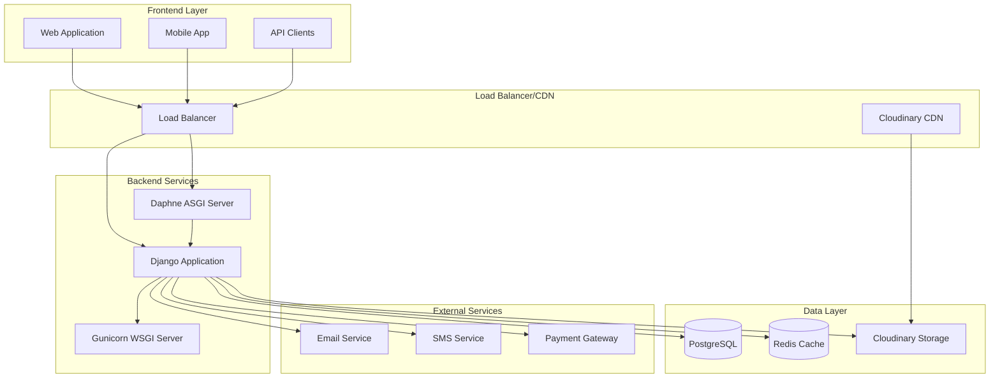

### Multi-Tenant Architecture Pattern


**To generate this diagram, use the following Mermaid code:**

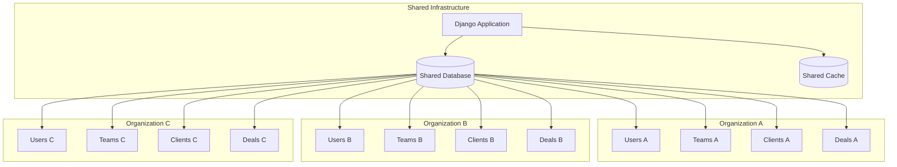

---

## Application Architecture

### Django Apps Structure


**To generate this diagram, use the following Mermaid code:**

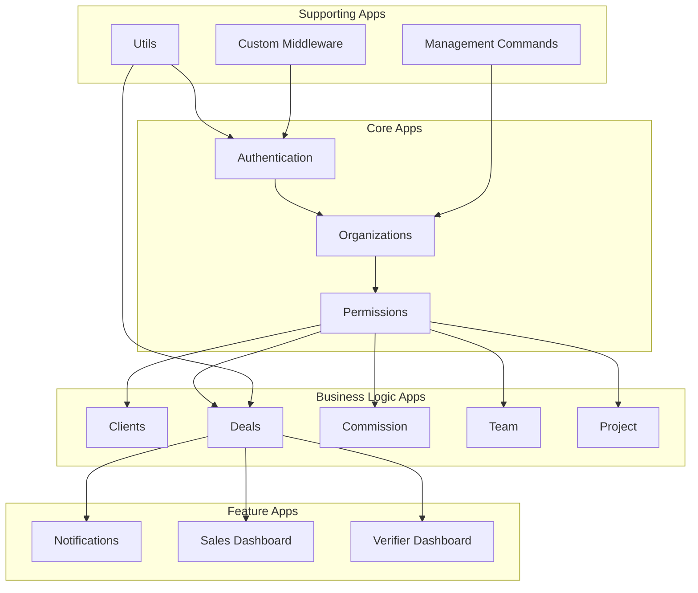

### Application Layer Architecture


**To generate this diagram, use the following Mermaid code:**

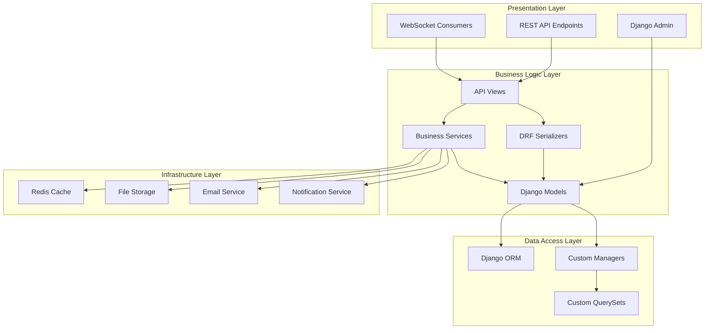

---

## Database Architecture

### Entity Relationship Diagram


**To generate this diagram, use the following Mermaid code:**

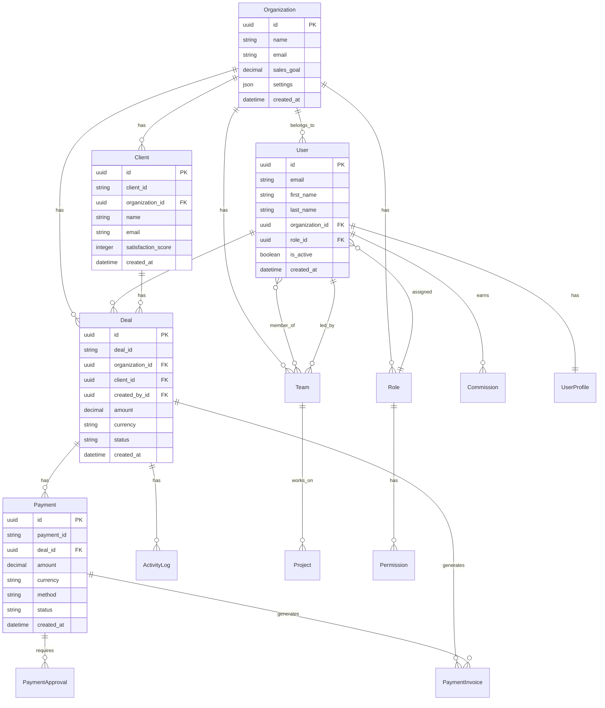

### Database Schema Patterns


**To generate this diagram, use the following Mermaid code:**

```mermaid
graph TB
    subgraph "Multi-tenancy Pattern"
        ORG_FILTER[Organization Filter]
        DATA_ISOLATION[Data Isolation]
        TENANT_AWARE[Tenant-Aware Queries]
    end

    subgraph "Audit Pattern"
        AUDIT_LOG[Activity Log]
        TIMESTAMP[Timestamps]
        USER_TRACKING[User Tracking]
    end

    subgraph "Security Pattern"
        UUID_PK[UUID Primary Keys]
        SOFT_DELETE[Soft Deletes]
        ENCRYPTION[Field Encryption]
    end

    subgraph "Performance Pattern"
        INDEXES[Strategic Indexes]
        QUERY_OPT[Query Optimization]
        CACHING[Database Caching]
    end

    ORG_FILTER --> DATA_ISOLATION
    DATA_ISOLATION --> TENANT_AWARE
    
    AUDIT_LOG --> TIMESTAMP
    TIMESTAMP --> USER_TRACKING
    
    UUID_PK --> SOFT_DELETE
    SOFT_DELETE --> ENCRYPTION
    
    INDEXES --> QUERY_OPT
    QUERY_OPT --> CACHING
```

---

## API Architecture

### RESTful API Structure


**To generate this diagram, use the following Mermaid code:**

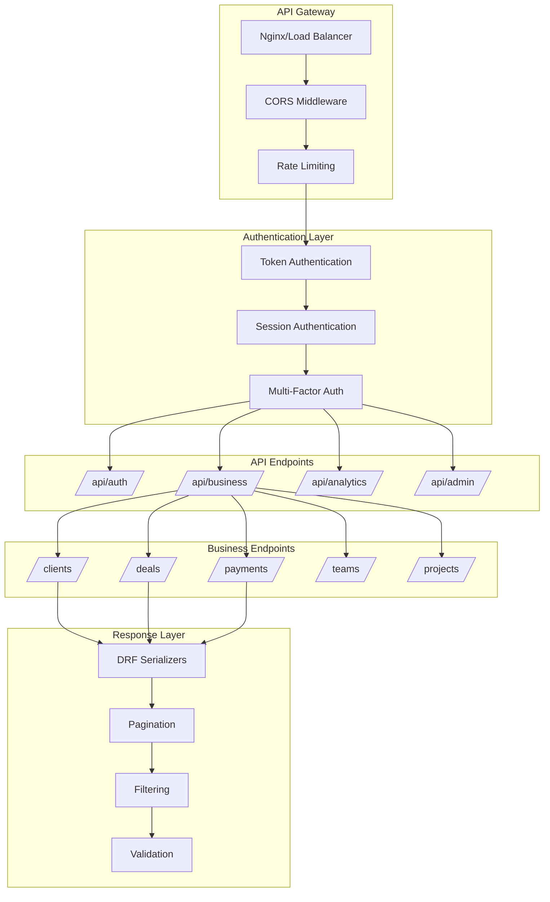

---

## Security Architecture

### Security Layers


**To generate this diagram, use the following Mermaid code:**

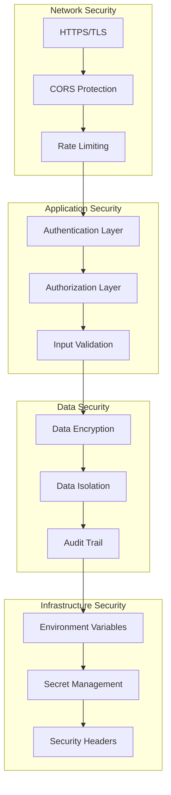

---

## Real-time Features

### WebSocket Architecture


**To generate this diagram, use the following Mermaid code:**

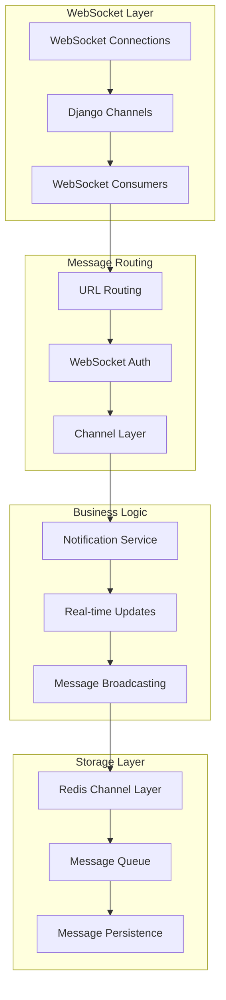

---

## Data Flow Diagrams

### Deal Processing Flow


**To generate this diagram, use the following Mermaid code:**

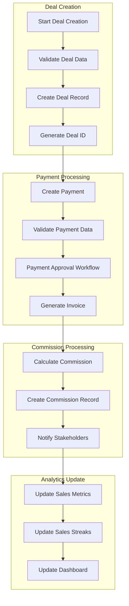

### User Authentication Flow


**To generate this diagram, use the following Mermaid code:**

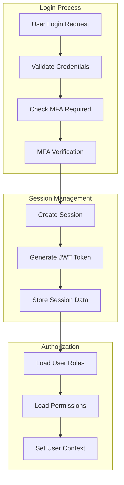

---

## Sequence Diagrams

### Deal Creation Sequence


**To generate this diagram, use the following Mermaid code:**

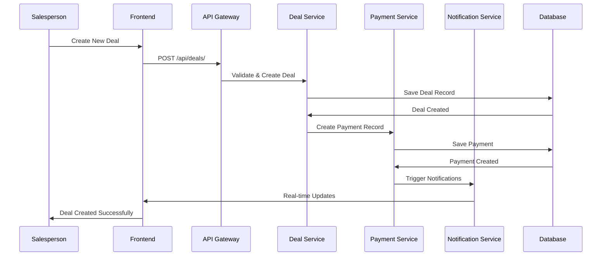

### Payment Approval Sequence


**To generate this diagram, use the following Mermaid code:**

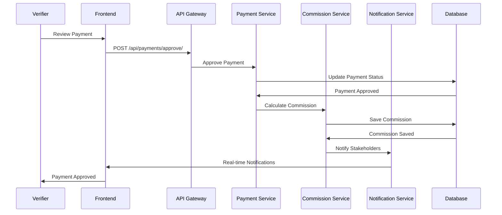

### Authentication & Authorization Sequence


**To generate this diagram, use the following Mermaid code:**

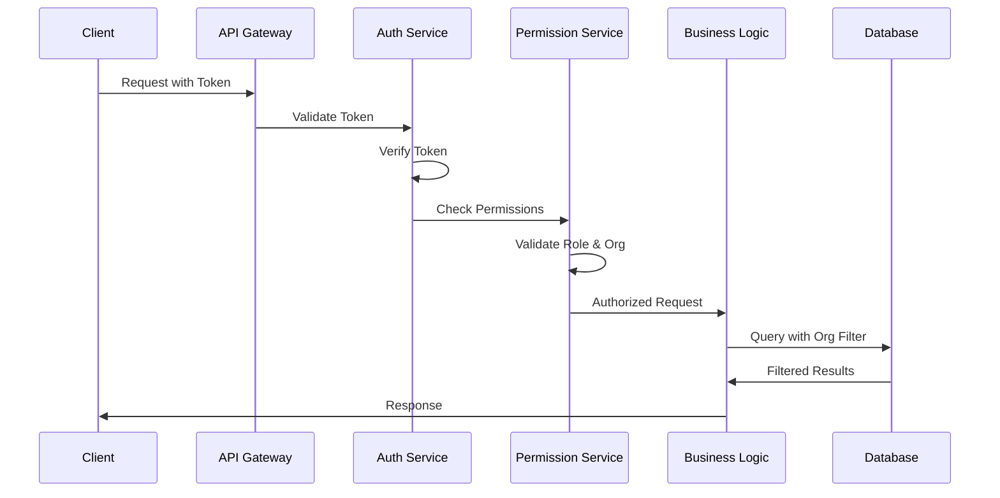

---

## Component Relationships

### Core Component Interaction


**To generate this diagram, use the following Mermaid code:**

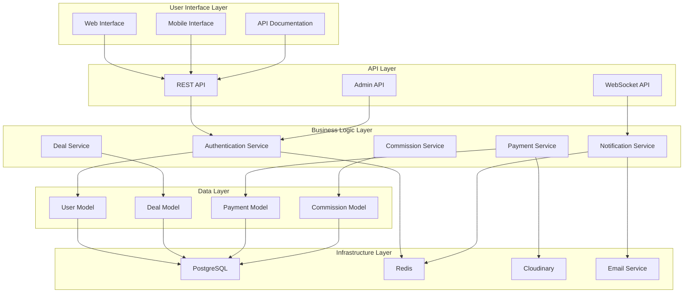

---

## Deployment Architecture

### Production Deployment


**To generate this diagram, use the following Mermaid code:**

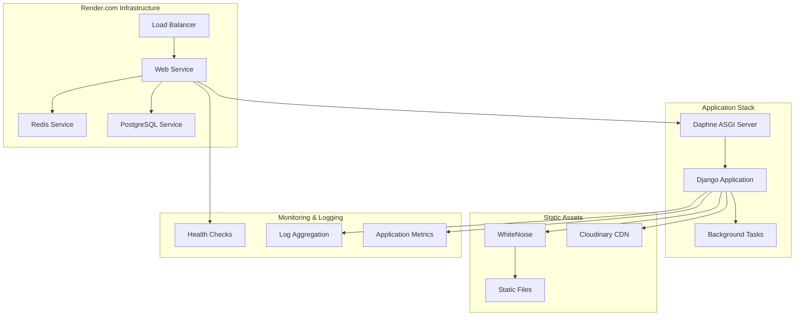

---

## Performance & Scalability

### Performance Optimization Strategy


**To generate this diagram, use the following Mermaid code:**

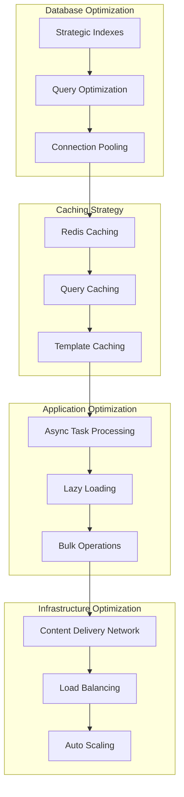

---

## Diagram Generation Instructions

### How to Generate the Diagrams

1. **Visit [Mermaid Live Editor](https://mermaid.live)**
2. **Copy and paste each Mermaid code block** from the sections above
3. **Export as PNG or SVG** using the export button
4. **Save the images** in a `diagrams/` folder in your project
5. **Update the image paths** in this documentation

### Recommended Export Settings:
- **Format**: PNG or SVG
- **Resolution**: High (for documentation)
- **Background**: White or transparent
- **Size**: Large (for readability)

### Alternative Tools:
- **Mermaid Chart**: https://www.mermaidchart.com/play
- **Mermaid Viewer**: https://mermaidviewer.com/
- **Draw.io**: https://draw.io (with Mermaid plugin)
- **VS Code Extension**: Mermaid Preview

### Folder Structure for Diagrams:
```
project-root/
├── diagrams/
│   ├── high-level-architecture.png
│   ├── multi-tenant-architecture.png
│   ├── django-apps-structure.png
│   ├── database-erd.png
│   ├── api-structure.png
│   ├── security-layers.png
│   ├── websocket-architecture.png
│   ├── deal-processing-flow.png
│   ├── sequence-diagrams/
│   │   ├── deal-creation-sequence.png
│   │   ├── payment-approval-sequence.png
│   │   └── auth-sequence.png
│   └── component-interaction.png
└── Backend_PRS_Architecture_Documentation_with_Images.md
```

---

## Key Business Workflows

### Sales Process Workflow


**To generate this diagram, use the following Mermaid code:**

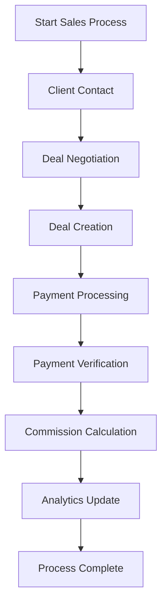

### Commission Processing Workflow


**To generate this diagram, use the following Mermaid code:**

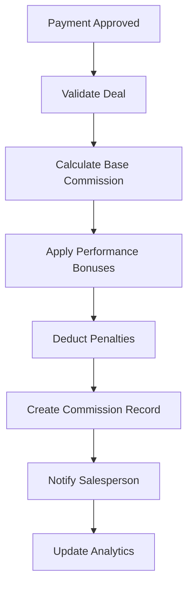

---

## Detailed Component Specifications

### Core Models and Their Relationships

#### User Model
```python
class User(AbstractBaseUser, PermissionsMixin):
    id = models.UUIDField(primary_key=True, default=uuid.uuid4)
    email = models.EmailField(unique=True)
    first_name = models.CharField(max_length=150)
    last_name = models.CharField(max_length=150)
    organization = models.ForeignKey(Organization, on_delete=models.CASCADE)
    role = models.ForeignKey(Role, on_delete=models.SET_NULL, null=True)
    is_active = models.BooleanField(default=True)
    created_at = models.DateTimeField(auto_now_add=True)
    updated_at = models.DateTimeField(auto_now=True)
```

#### Deal Model
```python
class Deal(models.Model):
    id = models.UUIDField(primary_key=True, default=uuid.uuid4)
    deal_id = models.CharField(max_length=50, unique=True)
    organization = models.ForeignKey(Organization, on_delete=models.CASCADE)
    client = models.ForeignKey(Client, on_delete=models.CASCADE)
    created_by = models.ForeignKey(User, on_delete=models.CASCADE)
    amount = models.DecimalField(max_digits=15, decimal_places=2)
    currency = models.CharField(max_length=3, default='USD')
    status = models.CharField(max_length=20, choices=DEAL_STATUS_CHOICES)
    created_at = models.DateTimeField(auto_now_add=True)
    updated_at = models.DateTimeField(auto_now=True)
```

#### Payment Model
```python
class Payment(models.Model):
    id = models.UUIDField(primary_key=True, default=uuid.uuid4)
    payment_id = models.CharField(max_length=50, unique=True)
    deal = models.ForeignKey(Deal, on_delete=models.CASCADE)
    amount = models.DecimalField(max_digits=15, decimal_places=2)
    currency = models.CharField(max_length=3, default='USD')
    method = models.CharField(max_length=20, choices=PAYMENT_METHOD_CHOICES)
    status = models.CharField(max_length=20, choices=PAYMENT_STATUS_CHOICES)
    created_at = models.DateTimeField(auto_now_add=True)
    updated_at = models.DateTimeField(auto_now=True)
```

### API Endpoints Overview

#### Authentication Endpoints
```
POST /api/auth/login/           # User login
POST /api/auth/logout/          # User logout
POST /api/auth/refresh/         # Refresh JWT token
GET  /api/auth/user/           # Get current user
PUT  /api/auth/user/           # Update user profile
POST /api/auth/change-password/ # Change password
```

#### Deal Management Endpoints
```
GET    /api/deals/              # List deals
POST   /api/deals/              # Create new deal
GET    /api/deals/{id}/         # Get deal details
PUT    /api/deals/{id}/         # Update deal
DELETE /api/deals/{id}/         # Delete deal
POST   /api/deals/{id}/approve/ # Approve deal
```

#### Payment Endpoints
```
GET    /api/payments/           # List payments
POST   /api/payments/           # Create payment
GET    /api/payments/{id}/      # Get payment details
PUT    /api/payments/{id}/      # Update payment
POST   /api/payments/{id}/approve/ # Approve payment
GET    /api/payments/{id}/invoice/ # Get payment invoice
```

#### Analytics Endpoints
```
GET /api/analytics/dashboard/   # Dashboard metrics
GET /api/analytics/sales/       # Sales analytics
GET /api/analytics/commission/  # Commission analytics
GET /api/analytics/performance/ # Performance metrics
```

---

## Security Implementation Details

### Authentication Middleware
```python
class TokenAuthenticationMiddleware:
    def __init__(self, get_response):
        self.get_response = get_response

    def __call__(self, request):
        token = request.META.get('HTTP_AUTHORIZATION')
        if token:
            user = self.authenticate_token(token)
            if user:
                request.user = user
        
        response = self.get_response(request)
        return response
```

### Permission System
```python
class OrganizationPermission(BasePermission):
    def has_permission(self, request, view):
        if not request.user.is_authenticated:
            return False
        
        # Check organization-level permissions
        return request.user.organization.is_active
    
    def has_object_permission(self, request, view, obj):
        # Ensure user can only access their organization's data
        return obj.organization == request.user.organization
```

### Data Isolation
```python
class OrganizationQuerySet(models.QuerySet):
    def for_organization(self, organization):
        return self.filter(organization=organization)

class OrganizationManager(models.Manager):
    def get_queryset(self):
        return OrganizationQuerySet(self.model, using=self._db)
    
    def for_organization(self, organization):
        return self.get_queryset().for_organization(organization)
```

---

## Conclusion

This comprehensive architecture documentation provides a complete overview of the Backend_PRS system with visual diagrams that can be generated using the provided Mermaid code. The system is designed with:

- **Enterprise-grade security** with multi-layer protection
- **Scalable multi-tenant architecture** for SaaS deployment
- **Real-time capabilities** for enhanced user experience
- **Comprehensive business logic** for payment processing and commission management
- **Modern technology stack** with Django and related frameworks
- **Production-ready deployment** configuration

The visual diagrams help stakeholders understand the system architecture, data flow, and component relationships, making it easier to maintain, extend, and scale the application.

---

## Next Steps

1. **Generate all diagrams** using the Mermaid code provided
2. **Create a diagrams folder** in your project root
3. **Export images** from Mermaid Live Editor
4. **Update image paths** in this documentation
5. **Review and customize** diagrams based on your specific needs
6. **Keep documentation updated** as the system evolves

This documentation serves as a living document that should be updated as the system architecture evolves.