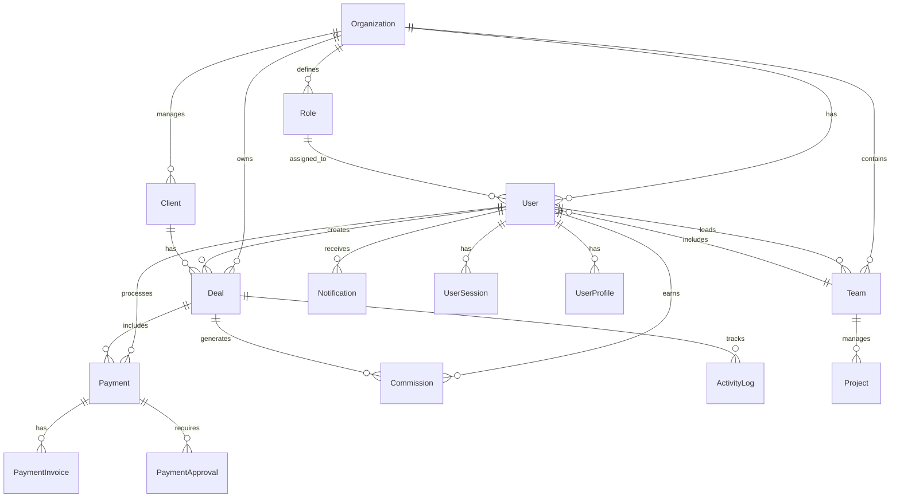

# Database Schema Documentation - Backend_PRS

## Overview

This document provides comprehensive documentation for the Backend_PRS database schema. The system uses PostgreSQL in production with SQLite fallback for development, implementing a multi-tenant architecture with organization-based data isolation.

## Database Architecture

### Multi-Tenant Design
- **Organization-based isolation**: Each organization's data is isolated
- **Shared database, separate schemas**: Single database with logical separation
- **Role-based access control**: Permissions controlled at application level
- **Audit trails**: Comprehensive logging for compliance

### Technology Stack
- **Primary Database**: PostgreSQL 12+
- **Development Database**: SQLite 3
- **ORM**: Django ORM with custom managers
- **Connection Pooling**: Django's built-in connection pooling
- **Caching**: Redis for query caching

## Database Models

### 1. Authentication App Models

#### User Model (`authentication_user`)
**Purpose**: Enhanced user model with multi-tenant support

```sql
CREATE TABLE authentication_user (
    id BIGSERIAL PRIMARY KEY,
    password VARCHAR(128) NOT NULL,
    last_login TIMESTAMP WITH TIME ZONE,
    is_superuser BOOLEAN NOT NULL,
    email VARCHAR(254) UNIQUE NOT NULL,
    first_name VARCHAR(150) NOT NULL,
    last_name VARCHAR(150) NOT NULL,
    is_staff BOOLEAN NOT NULL,
    is_active BOOLEAN NOT NULL,
    date_joined TIMESTAMP WITH TIME ZONE NOT NULL,
    organization_id BIGINT REFERENCES organization_organization(id),
    role_id BIGINT REFERENCES permissions_role(id),
    phone VARCHAR(20),
    address TEXT,
    sales_target DECIMAL(10,2),
    current_streak INTEGER DEFAULT 0,
    status VARCHAR(20) DEFAULT 'active',
    created_at TIMESTAMP WITH TIME ZONE NOT NULL,
    updated_at TIMESTAMP WITH TIME ZONE NOT NULL
);
```

**Key Features**:
- Email-based authentication (`USERNAME_FIELD = 'email'`)
- Multi-tenant organization relationship
- Role-based permissions
- Sales target tracking
- Streak gamification
- Status management

#### UserSession Model (`authentication_usersession`)
**Purpose**: Track active user sessions for security

```sql
CREATE TABLE authentication_usersession (
    id BIGSERIAL PRIMARY KEY,
    user_id BIGINT NOT NULL REFERENCES authentication_user(id),
    session_key VARCHAR(40) NOT NULL,
    ip_address INET,
    user_agent TEXT,
    created_at TIMESTAMP WITH TIME ZONE NOT NULL,
    expires_at TIMESTAMP WITH TIME ZONE NOT NULL,
    is_active BOOLEAN DEFAULT TRUE
);
```

#### UserProfile Model (`authentication_userprofile`)
**Purpose**: Extended user profile information

```sql
CREATE TABLE authentication_userprofile (
    id BIGSERIAL PRIMARY KEY,
    user_id BIGINT NOT NULL REFERENCES authentication_user(id),
    profile_picture VARCHAR(100),
    bio TEXT,
    preferences JSONB,
    created_at TIMESTAMP WITH TIME ZONE NOT NULL,
    updated_at TIMESTAMP WITH TIME ZONE NOT NULL
);
```

### 2. Organization App Models

#### Organization Model (`organization_organization`)
**Purpose**: Multi-tenant organization management

```sql
CREATE TABLE organization_organization (
    id BIGSERIAL PRIMARY KEY,
    name VARCHAR(100) NOT NULL,
    description TEXT,
    email VARCHAR(254),
    phone VARCHAR(20),
    address TEXT,
    website VARCHAR(200),
    logo VARCHAR(100),
    is_active BOOLEAN DEFAULT TRUE,
    created_at TIMESTAMP WITH TIME ZONE NOT NULL,
    updated_at TIMESTAMP WITH TIME ZONE NOT NULL
);
```

### 3. Permissions App Models

#### Role Model (`permissions_role`)
**Purpose**: Role-based access control

```sql
CREATE TABLE permissions_role (
    id BIGSERIAL PRIMARY KEY,
    name VARCHAR(50) NOT NULL,
    description TEXT,
    organization_id BIGINT NOT NULL REFERENCES organization_organization(id),
    is_active BOOLEAN DEFAULT TRUE,
    created_at TIMESTAMP WITH TIME ZONE NOT NULL,
    updated_at TIMESTAMP WITH TIME ZONE NOT NULL,
    UNIQUE(name, organization_id)
);
```

### 4. Team App Models

#### Team Model (`team_team`)
**Purpose**: Team organization and management

```sql
CREATE TABLE team_team (
    id BIGSERIAL PRIMARY KEY,
    name VARCHAR(100) NOT NULL,
    description TEXT,
    organization_id BIGINT NOT NULL REFERENCES organization_organization(id),
    team_lead_id BIGINT REFERENCES authentication_user(id),
    is_active BOOLEAN DEFAULT TRUE,
    created_at TIMESTAMP WITH TIME ZONE NOT NULL,
    updated_at TIMESTAMP WITH TIME ZONE NOT NULL
);
```

### 5. Project App Models

#### Project Model (`project_project`)
**Purpose**: Project management and tracking

```sql
CREATE TABLE project_project (
    id BIGSERIAL PRIMARY KEY,
    name VARCHAR(100) NOT NULL,
    description TEXT,
    team_id BIGINT NOT NULL REFERENCES team_team(id),
    status VARCHAR(20) DEFAULT 'active',
    start_date DATE,
    end_date DATE,
    created_by_id BIGINT NOT NULL REFERENCES authentication_user(id),
    created_at TIMESTAMP WITH TIME ZONE NOT NULL,
    updated_at TIMESTAMP WITH TIME ZONE NOT NULL
);
```

### 6. Clients App Models

#### Client Model (`clients_client`)
**Purpose**: Client relationship management

```sql
CREATE TABLE clients_client (
    id BIGSERIAL PRIMARY KEY,
    name VARCHAR(100) NOT NULL,
    email VARCHAR(254),
    phone VARCHAR(20),
    address TEXT,
    organization_id BIGINT NOT NULL REFERENCES organization_organization(id),
    created_by_id BIGINT NOT NULL REFERENCES authentication_user(id),
    satisfaction_rating DECIMAL(3,2),
    notes TEXT,
    is_active BOOLEAN DEFAULT TRUE,
    created_at TIMESTAMP WITH TIME ZONE NOT NULL,
    updated_at TIMESTAMP WITH TIME ZONE NOT NULL
);
```

### 7. Deals App Models (Core Business Logic)

#### Deal Model (`deals_deal`)
**Purpose**: Main deal/transaction management

```sql
CREATE TABLE deals_deal (
    id UUID PRIMARY KEY DEFAULT gen_random_uuid(),
    deal_id VARCHAR(20) UNIQUE NOT NULL,
    client_id BIGINT NOT NULL REFERENCES clients_client(id),
    amount DECIMAL(10,2) NOT NULL,
    currency VARCHAR(3) DEFAULT 'USD',
    description TEXT,
    status VARCHAR(20) DEFAULT 'pending',
    payment_method VARCHAR(20),
    payment_status VARCHAR(20) DEFAULT 'pending',
    verification_status VARCHAR(20) DEFAULT 'pending',
    client_status VARCHAR(20) DEFAULT 'new',
    is_original BOOLEAN DEFAULT TRUE,
    organization_id BIGINT NOT NULL REFERENCES organization_organization(id),
    created_by_id BIGINT NOT NULL REFERENCES authentication_user(id),
    created_at TIMESTAMP WITH TIME ZONE NOT NULL,
    updated_at TIMESTAMP WITH TIME ZONE NOT NULL
);
```

**Key Features**:
- UUID primary key for security
- Auto-generated deal IDs (DLID0001 format)
- Multiple status tracking
- Multi-currency support
- Audit fields

#### Payment Model (`deals_payment`)
**Purpose**: Payment processing and tracking

```sql
CREATE TABLE deals_payment (
    id BIGSERIAL PRIMARY KEY,
    deal_id UUID NOT NULL REFERENCES deals_deal(id),
    transaction_id VARCHAR(20) UNIQUE NOT NULL,
    amount DECIMAL(10,2) NOT NULL,
    payment_method VARCHAR(20) NOT NULL,
    status VARCHAR(20) DEFAULT 'pending',
    receipt_image VARCHAR(100),
    cheque_number VARCHAR(50),
    bank_reference VARCHAR(100),
    notes TEXT,
    verified_by_id BIGINT REFERENCES authentication_user(id),
    verified_at TIMESTAMP WITH TIME ZONE,
    created_by_id BIGINT NOT NULL REFERENCES authentication_user(id),
    created_at TIMESTAMP WITH TIME ZONE NOT NULL,
    updated_at TIMESTAMP WITH TIME ZONE NOT NULL
);
```

#### PaymentInvoice Model (`deals_paymentinvoice`)
**Purpose**: Invoice generation for payments

```sql
CREATE TABLE deals_paymentinvoice (
    id BIGSERIAL PRIMARY KEY,
    payment_id BIGINT NOT NULL REFERENCES deals_payment(id),
    invoice_number VARCHAR(50) UNIQUE NOT NULL,
    invoice_file VARCHAR(100),
    amount DECIMAL(10,2) NOT NULL,
    tax_amount DECIMAL(10,2) DEFAULT 0,
    total_amount DECIMAL(10,2) NOT NULL,
    status VARCHAR(20) DEFAULT 'draft',
    generated_at TIMESTAMP WITH TIME ZONE NOT NULL,
    created_at TIMESTAMP WITH TIME ZONE NOT NULL
);
```

#### PaymentApproval Model (`deals_paymentapproval`)
**Purpose**: Payment verification workflow

```sql
CREATE TABLE deals_paymentapproval (
    id BIGSERIAL PRIMARY KEY,
    payment_id BIGINT NOT NULL REFERENCES deals_payment(id),
    approver_id BIGINT NOT NULL REFERENCES authentication_user(id),
    status VARCHAR(20) DEFAULT 'pending',
    comments TEXT,
    approved_at TIMESTAMP WITH TIME ZONE,
    created_at TIMESTAMP WITH TIME ZONE NOT NULL,
    updated_at TIMESTAMP WITH TIME ZONE NOT NULL
);
```

#### ActivityLog Model (`deals_activitylog`)
**Purpose**: Comprehensive audit trail

```sql
CREATE TABLE deals_activitylog (
    id BIGSERIAL PRIMARY KEY,
    deal_id UUID NOT NULL REFERENCES deals_deal(id),
    user_id BIGINT NOT NULL REFERENCES authentication_user(id),
    action VARCHAR(50) NOT NULL,
    description TEXT,
    old_values JSONB,
    new_values JSONB,
    ip_address INET,
    user_agent TEXT,
    created_at TIMESTAMP WITH TIME ZONE NOT NULL
);
```

### 8. Commission App Models

#### Commission Model (`commission_commission`)
**Purpose**: Commission calculation and tracking

```sql
CREATE TABLE commission_commission (
    id BIGSERIAL PRIMARY KEY,
    deal_id UUID NOT NULL REFERENCES deals_deal(id),
    user_id BIGINT NOT NULL REFERENCES authentication_user(id),
    base_amount DECIMAL(10,2) NOT NULL,
    commission_rate DECIMAL(5,2) NOT NULL,
    commission_amount DECIMAL(10,2) NOT NULL,
    bonus_amount DECIMAL(10,2) DEFAULT 0,
    penalty_amount DECIMAL(10,2) DEFAULT 0,
    final_amount DECIMAL(10,2) NOT NULL,
    currency VARCHAR(3) DEFAULT 'USD',
    exchange_rate DECIMAL(10,4) DEFAULT 1.0000,
    status VARCHAR(20) DEFAULT 'pending',
    paid_at TIMESTAMP WITH TIME ZONE,
    created_at TIMESTAMP WITH TIME ZONE NOT NULL,
    updated_at TIMESTAMP WITH TIME ZONE NOT NULL
);
```

### 9. Notifications App Models

#### Notification Model (`notifications_notification`)
**Purpose**: Real-time notification system

```sql
CREATE TABLE notifications_notification (
    id BIGSERIAL PRIMARY KEY,
    recipient_id BIGINT NOT NULL REFERENCES authentication_user(id),
    title VARCHAR(200) NOT NULL,
    message TEXT NOT NULL,
    notification_type VARCHAR(50) NOT NULL,
    data JSONB,
    is_read BOOLEAN DEFAULT FALSE,
    read_at TIMESTAMP WITH TIME ZONE,
    created_at TIMESTAMP WITH TIME ZONE NOT NULL
);
```

#### NotificationSettings Model (`notifications_notificationsettings`)
**Purpose**: User notification preferences

```sql
CREATE TABLE notifications_notificationsettings (
    id BIGSERIAL PRIMARY KEY,
    user_id BIGINT NOT NULL REFERENCES authentication_user(id),
    email_notifications BOOLEAN DEFAULT TRUE,
    push_notifications BOOLEAN DEFAULT TRUE,
    sms_notifications BOOLEAN DEFAULT FALSE,
    notification_types JSONB,
    created_at TIMESTAMP WITH TIME ZONE NOT NULL,
    updated_at TIMESTAMP WITH TIME ZONE NOT NULL
);
```

#### NotificationTemplate Model (`notifications_notificationtemplate`)
**Purpose**: Notification template management

```sql
CREATE TABLE notifications_notificationtemplate (
    id BIGSERIAL PRIMARY KEY,
    name VARCHAR(100) NOT NULL,
    title VARCHAR(200) NOT NULL,
    message TEXT NOT NULL,
    notification_type VARCHAR(50) NOT NULL,
    variables JSONB,
    is_active BOOLEAN DEFAULT TRUE,
    created_at TIMESTAMP WITH TIME ZONE NOT NULL,
    updated_at TIMESTAMP WITH TIME ZONE NOT NULL
);
```

### 10. Sales Dashboard App Models

#### DailyStreakRecord Model (`sales_dashboard_dailystreakrecord`)
**Purpose**: Daily performance tracking for gamification

```sql
CREATE TABLE sales_dashboard_dailystreakrecord (
    id BIGSERIAL PRIMARY KEY,
    user_id BIGINT NOT NULL REFERENCES authentication_user(id),
    date DATE NOT NULL,
    deals_created INTEGER DEFAULT 0,
    payments_received INTEGER DEFAULT 0,
    total_amount DECIMAL(10,2) DEFAULT 0,
    streak_count INTEGER DEFAULT 0,
    is_active_day BOOLEAN DEFAULT TRUE,
    created_at TIMESTAMP WITH TIME ZONE NOT NULL,
    UNIQUE(user_id, date)
);
```

### 11. Verifier Dashboard App Models

#### AuditLogs Model (`verifier_dashboard_auditlogs`)
**Purpose**: System audit logging

```sql
CREATE TABLE verifier_dashboard_auditlogs (
    id BIGSERIAL PRIMARY KEY,
    user_id BIGINT NOT NULL REFERENCES authentication_user(id),
    action VARCHAR(100) NOT NULL,
    resource_type VARCHAR(50) NOT NULL,
    resource_id VARCHAR(100),
    old_values JSONB,
    new_values JSONB,
    ip_address INET,
    user_agent TEXT,
    created_at TIMESTAMP WITH TIME ZONE NOT NULL
);
```

## Database Relationships

### Core Entity Relationships



### Multi-Tenant Isolation

```sql
-- Example of organization-based filtering
SELECT * FROM deals_deal 
WHERE organization_id = :user_organization_id;

-- Users can only see data from their organization
SELECT * FROM clients_client 
WHERE organization_id = (
    SELECT organization_id FROM authentication_user 
    WHERE id = :user_id
);
```

## Indexes and Performance

### Strategic Indexes

```sql
-- Multi-tenant queries
CREATE INDEX idx_deals_organization_id ON deals_deal(organization_id);
CREATE INDEX idx_clients_organization_id ON clients_client(organization_id);
CREATE INDEX idx_users_organization_id ON authentication_user(organization_id);

-- Performance-critical queries
CREATE INDEX idx_deals_created_by ON deals_deal(created_by_id);
CREATE INDEX idx_payments_deal_id ON deals_payment(deal_id);
CREATE INDEX idx_notifications_recipient ON notifications_notification(recipient_id);
CREATE INDEX idx_notifications_unread ON notifications_notification(recipient_id, is_read);

-- Unique constraints
CREATE UNIQUE INDEX idx_deals_deal_id ON deals_deal(deal_id);
CREATE UNIQUE INDEX idx_payments_transaction_id ON deals_payment(transaction_id);

-- Composite indexes for dashboard queries
CREATE INDEX idx_deals_org_status ON deals_deal(organization_id, status);
CREATE INDEX idx_payments_status_created ON deals_payment(status, created_at);
```

### Query Optimization

```sql
-- Optimized dashboard query
SELECT 
    COUNT(*) as total_deals,
    SUM(CASE WHEN status = 'completed' THEN 1 ELSE 0 END) as completed_deals,
    SUM(amount) as total_amount
FROM deals_deal 
WHERE organization_id = :org_id 
  AND created_at >= :start_date 
  AND created_at <= :end_date;

-- Optimized notification query
SELECT * FROM notifications_notification 
WHERE recipient_id = :user_id 
  AND is_read = FALSE 
ORDER BY created_at DESC 
LIMIT 50;
```

## Data Integrity

### Constraints

```sql
-- Foreign key constraints
ALTER TABLE deals_deal ADD CONSTRAINT fk_deals_organization 
    FOREIGN KEY (organization_id) REFERENCES organization_organization(id);

-- Check constraints
ALTER TABLE deals_payment ADD CONSTRAINT chk_payment_amount 
    CHECK (amount > 0);

ALTER TABLE commission_commission ADD CONSTRAINT chk_commission_rate 
    CHECK (commission_rate >= 0 AND commission_rate <= 100);

-- Unique constraints
ALTER TABLE deals_deal ADD CONSTRAINT uq_deal_id UNIQUE (deal_id);
ALTER TABLE deals_payment ADD CONSTRAINT uq_transaction_id UNIQUE (transaction_id);
```

### Triggers

```sql
-- Auto-update timestamps
CREATE OR REPLACE FUNCTION update_updated_at_column()
RETURNS TRIGGER AS $$
BEGIN
    NEW.updated_at = NOW();
    RETURN NEW;
END;
$$ language 'plpgsql';

CREATE TRIGGER update_deals_updated_at 
    BEFORE UPDATE ON deals_deal 
    FOR EACH ROW EXECUTE FUNCTION update_updated_at_column();
```

## Security

### Row-Level Security (RLS)

```sql
-- Enable RLS for multi-tenant isolation
ALTER TABLE deals_deal ENABLE ROW LEVEL SECURITY;

-- Policy for organization isolation
CREATE POLICY deals_organization_policy ON deals_deal
    USING (organization_id = current_setting('app.current_organization_id')::bigint);

-- Policy for user access
CREATE POLICY deals_user_policy ON deals_deal
    USING (
        organization_id = current_setting('app.current_organization_id')::bigint
        AND (
            current_setting('app.current_user_role') = 'super_admin'
            OR current_setting('app.current_user_role') = 'org_admin'
            OR created_by_id = current_setting('app.current_user_id')::bigint
        )
    );
```

### Data Encryption

```sql
-- Sensitive data encryption
CREATE EXTENSION IF NOT EXISTS pgcrypto;

-- Encrypt sensitive fields
ALTER TABLE clients_client ADD COLUMN encrypted_notes TEXT;
UPDATE clients_client SET encrypted_notes = pgp_sym_encrypt(notes, 'encryption_key');
```

## Backup and Recovery

### Backup Strategy

```bash
# Full database backup
pg_dump -h localhost -U postgres -d prs_db > backup_$(date +%Y%m%d).sql

# Schema-only backup
pg_dump -h localhost -U postgres -d prs_db -s > schema_backup.sql

# Data-only backup
pg_dump -h localhost -U postgres -d prs_db -a > data_backup.sql
```

### Recovery Process

```bash
# Restore from backup
psql -h localhost -U postgres -d prs_db < backup_20231201.sql

# Restore specific table
pg_restore -h localhost -U postgres -d prs_db -t deals_deal backup.dump
```

## Monitoring and Maintenance

### Performance Monitoring

```sql
-- Check slow queries
SELECT query, mean_time, calls, total_time
FROM pg_stat_statements
WHERE mean_time > 1000
ORDER BY mean_time DESC;

-- Check index usage
SELECT schemaname, tablename, indexname, idx_tup_read, idx_tup_fetch
FROM pg_stat_user_indexes
WHERE idx_tup_read > 0
ORDER BY idx_tup_read DESC;

-- Check table sizes
SELECT 
    schemaname,
    tablename,
    pg_size_pretty(pg_total_relation_size(schemaname||'.'||tablename)) as size
FROM pg_tables
WHERE schemaname = 'public'
ORDER BY pg_total_relation_size(schemaname||'.'||tablename) DESC;
```

### Maintenance Tasks

```sql
-- Update statistics
ANALYZE;

-- Vacuum tables
VACUUM ANALYZE deals_deal;
VACUUM ANALYZE deals_payment;

-- Reindex if needed
REINDEX TABLE deals_deal;
```

## Migration Strategy

### Version Control

```python
# Example migration file
from django.db import migrations, models

class Migration(migrations.Migration):
    dependencies = [
        ('deals', '0001_initial'),
    ]

    operations = [
        migrations.AddField(
            model_name='deal',
            name='new_field',
            field=models.CharField(max_length=100, null=True),
        ),
    ]
```

### Migration Best Practices

1. **Always backup before migrations**
2. **Test migrations on staging first**
3. **Use reversible migrations**
4. **Monitor migration performance**
5. **Document breaking changes**

## Troubleshooting

### Common Issues

```sql
-- Check for locks
SELECT * FROM pg_locks WHERE NOT granted;

-- Check for long-running queries
SELECT pid, now() - pg_stat_activity.query_start AS duration, query
FROM pg_stat_activity
WHERE (now() - pg_stat_activity.query_start) > interval '5 minutes';

-- Check connection count
SELECT count(*) FROM pg_stat_activity;
```

### Performance Issues

```sql
-- Analyze slow queries
EXPLAIN ANALYZE SELECT * FROM deals_deal 
WHERE organization_id = 1 AND status = 'pending';

-- Check missing indexes
SELECT schemaname, tablename, attname, n_distinct, correlation
FROM pg_stats
WHERE schemaname = 'public' AND n_distinct > 100;
```

## Future Enhancements

### Planned Features

1. **Partitioning**: Implement table partitioning for large datasets
2. **Read Replicas**: Add read replicas for better performance
3. **Archiving**: Implement data archiving strategy
4. **Analytics**: Add OLAP capabilities for advanced analytics
5. **Encryption**: Implement field-level encryption

### Scaling Considerations

1. **Database Sharding**: For multi-tenant scaling
2. **Connection Pooling**: Implement pgBouncer
3. **Caching**: Enhanced Redis caching strategy
4. **Monitoring**: Advanced monitoring with Prometheus/Grafana

---

This database schema provides a solid foundation for a multi-tenant SaaS application with proper security, performance, and maintainability considerations.